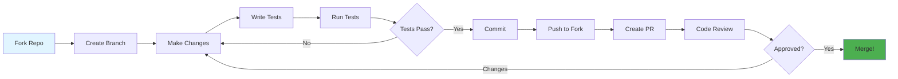
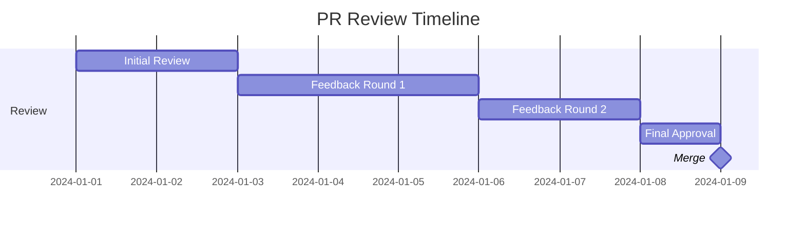

<div align="center">

# 🤝 Contributing

### MCP-Axon 项目贡献指南

[🏠 Home](../README.md) • [📖 User Guide](USER_GUIDE.md) • [📘 API Reference](API_REFERENCE.md)

---

</div>

## 🎯 Welcome Contributors!

感谢您对 MCP-Axon 项目的关注！我们欢迎所有形式的贡献，包括但不限于代码、文档、测试、错误报告和功能建议。本指南将帮助您了解如何为项目做出贡献。

<div align="center">

### 🌟 Ways to Contribute

<table>
<tr>
<td width="25%" align="center">
<br>
<b>💻 代码贡献</b><br>
修复 bug、添加新功能、性能优化、编写测试、改进代码注释
</td>
<td width="25%" align="center">
<br>
<b>Documentation</b><br>
Improve docs & guides
</td>
<td width="25%" align="center">
<br>
<b>Testing</b><br>
Write tests & find bugs
</td>
<td width="25%" align="center">
<br>
<b>Community</b><br>
Help & support others
</td>
</tr>
</table>

</div>

---

## 📋 Table of Contents

- [Code of Conduct](#code-of-conduct)
- [Getting Started](#getting-started)
- [Development Workflow](#development-workflow)
- [Coding Standards](#coding-standards)
- [Testing Guidelines](#testing-guidelines)
- [Documentation](#documentation)
- [Submitting Changes](#submitting-changes)
- [Review Process](#review-process)
- [Community](#community)

---

## Code of Conduct

<div align="center">

### 🤗 Be Kind and Respectful

</div>

We are committed to providing a welcoming and inclusive environment. By participating, you agree to:

<table>
<tr>
<td width="50%">

**✅ DO**
- Be respectful and considerate
- Welcome newcomers
- Accept constructive criticism
- Focus on what's best for the community
- Show empathy towards others

</td>
<td width="50%">

**❌ DON'T**
- Use offensive language
- Harass or insult others
- Publish private information
- Make personal attacks
- Disrupt discussions

</td>
</tr>
</table>

> 📜 **Full Code of Conduct:** [CODE_OF_CONDUCT.md](CODE_OF_CONDUCT.md)

---

## Getting Started

### Prerequisites

Before you begin, ensure you have:

- ✅ **Git** - Version control
- ✅ **Rust 1.75+** - Programming language
- ✅ **Cargo** - Rust package manager
- ✅ **IDE** - VS Code, IntelliJ, or similar

<details>
<summary><b>🔧 Setting Up Your Environment</b></summary>

**1. Install Rust:**
```bash
curl --proto '=https' --tlsv1.2 -sSf https://sh.rustup.rs | sh
```

**2. Install additional tools:**
```bash
# Code formatter
rustup component add rustfmt

# Linter
rustup component add clippy

# Code coverage (optional)
cargo install cargo-tarpaulin
```

**3. Verify installation:**
```bash
python --version
pip --version
```

</details>

### Fork and Clone

<table>
<tr>
<td width="50%">

**1. Fork the Repository**

Click the "Fork" button on GitHub

</td>
<td width="50%">

**2. Clone Your Fork**

```bash
git clone https://github.com/YOUR_USERNAME/mcp-axon.git
cd mcp-axon
```

</td>
</tr>
<tr>
<td width="50%">

**3. Add Upstream Remote**

```bash
git remote add upstream \
  https://github.com/ORIGINAL/mcp-axon.git
```

</td>
<td width="50%">

**4. Verify Remotes**

```bash
git remote -v
# origin    your-fork
# upstream  original-repo
```

</td>
</tr>
</table>

### Build and Test

```bash
# Build the project
python -m build

# Run tests
python -m pytest tests/

# Run with examples
python -m src.api.mcp_server --help
```

✅ **Success!** You're ready to contribute!

---

## Development Workflow

<div align="center">

### 🔄 Standard Contribution Flow

</div>



### Step-by-Step Guide

#### 1️⃣ Create a Branch

```bash
# Update your fork
git fetch upstream
git checkout main
git merge upstream/main

# Create feature branch
git checkout -b feature/your-feature-name

# Or for bug fixes
git checkout -b fix/issue-123
```

**Branch Naming:**
- `feature/` - New features
- `fix/` - Bug fixes
- `docs/` - Documentation
- `test/` - Test improvements
- `refactor/` - Code refactoring

#### 2️⃣ Make Your Changes

<table>
<tr>
<td width="50%">

**Writing Code:**
```rust
// Add your implementation
pub fn new_feature() -> Result<()> {
    // Your code here
    Ok(())
}
```

</td>
<td width="50%">

**Adding Tests:**
```rust
#[test]
fn test_new_feature() {
    let result = new_feature();
    assert!(result.is_ok());
}
```

</td>
</tr>
</table>

#### 3️⃣ Test Your Changes

```bash
# Format code
cargo fmt

# Run linter
cargo clippy -- -D warnings

# Run all tests
cargo test --all-features

# Run specific test
cargo test test_new_feature

# Check coverage (optional)
cargo tarpaulin --out Html
```

#### 4️⃣ Commit Your Changes

**Good Commit Messages:**

```bash
# Format: <type>(<scope>): <description>

git commit -m "feat(encryption): add AES-256 support"
git commit -m "fix(key-manager): resolve memory leak"
git commit -m "docs(readme): update installation instructions"
git commit -m "test(cipher): add edge case tests"
```

**Commit Types:**
- `feat` - New feature
- `fix` - Bug fix
- `docs` - Documentation
- `style` - Formatting
- `refactor` - Code restructuring
- `test` - Adding tests
- `chore` - Maintenance

<details>
<summary><b>📝 Commit Message Template</b></summary>

```
<type>(<scope>): <short summary>

<detailed description>

<footer>
```

**Example:**
```
feat(api): add batch encryption support

Implement batch processing for multiple encryption operations.
This improves performance by 40% for bulk operations.

Closes #123
```

</details>

#### 5️⃣ Push to Your Fork

```bash
git push origin feature/your-feature-name
```

#### 6️⃣ Create Pull Request

1. Go to your fork on GitHub
2. Click "Compare & pull request"
3. Fill in the PR template
4. Link related issues
5. Submit!

---

## Coding Standards

<div align="center">

### ✨ Write Clean, Maintainable Code

</div>

### Rust Style Guide

Follow the [Rust Style Guide](https://rust-lang.github.io/api-guidelines/):

<table>
<tr>
<td width="50%">

**✅ Good**

```rust
// Descriptive names
pub fn encrypt_data(
    plaintext: &[u8],
    key: &Key,
) -> Result<Vec<u8>> {
    // Implementation
}

// Proper error handling
match operation() {
    Ok(result) => result,
    Err(e) => return Err(e),
}
```

</td>
<td width="50%">

**❌ Bad**

```rust
// Vague names
pub fn enc(d: &[u8], k: &Key) 
    -> Result<Vec<u8>> {
    // Implementation
}

// Ignoring errors
let result = operation().unwrap();
```

</td>
</tr>
</table>

### Code Organization

```
src/
├── lib.rs           # Public API
├── core/            # Core functionality
│   ├── mod.rs
│   ├── engine.rs
│   └── manager.rs
├── algorithms/      # Algorithm implementations
│   ├── mod.rs
│   ├── aes.rs
│   └── ecdsa.rs
├── error.rs         # Error types
└── utils/           # Utilities
    ├── mod.rs
    └── helpers.rs
```

### Documentation

<details>
<summary><b>📖 Documentation Standards</b></summary>

**Every public item must have documentation:**

```rust
/// Encrypts data using the specified algorithm.
///
/// # Arguments
///
/// * `data` - The plaintext data to encrypt
/// * `key` - The encryption key
///
/// # Returns
///
/// Returns the encrypted ciphertext on success.
///
/// # Errors
///
/// Returns `Error::EncryptionFailed` if encryption fails.
///
/// # Examples
///
/// ```
/// use project_name::{encrypt, Key};
///
/// let key = Key::generate()?;
/// let ciphertext = encrypt(b"secret", &key)?;
/// ```
pub fn encrypt(data: &[u8], key: &Key) -> Result<Vec<u8>> {
    // Implementation
}
```

</details>

### Error Handling

```rust
// ✅ Use Result types
pub fn fallible_operation() -> Result<Value, Error> {
    // Implementation
}

// ✅ Provide context
Err(Error::EncryptionFailed {
    reason: "Invalid key size",
    context: format!("Expected {}, got {}", expected, actual),
})

// ❌ Don't panic in library code
// panic!("Something went wrong");  // Bad!
```

---

## Testing Guidelines

<div align="center">

### 🧪 Test Everything!

</div>

### Test Categories

<table>
<tr>
<th>Type</th>
<th>Purpose</th>
<th>Location</th>
</tr>
<tr>
<td><b>Unit Tests</b></td>
<td>Test individual functions</td>
<td><code>src/*.rs</code> (inline)</td>
</tr>
<tr>
<td><b>Integration Tests</b></td>
<td>Test public API</td>
<td><code>tests/</code></td>
</tr>
<tr>
<td><b>Doc Tests</b></td>
<td>Test examples in docs</td>
<td>Doc comments</td>
</tr>
<tr>
<td><b>Benchmarks</b></td>
<td>Performance tests</td>
<td><code>benches/</code></td>
</tr>
</table>

### Writing Tests

**Unit Test Example:**

```rust
#[cfg(test)]
mod tests {
    use super::*;

    #[test]
    fn test_encrypt_decrypt() {
        let key = Key::generate().unwrap();
        let plaintext = b"Hello, World!";
        
        let ciphertext = encrypt(plaintext, &key).unwrap();
        let decrypted = decrypt(&ciphertext, &key).unwrap();
        
        assert_eq!(plaintext, &decrypted[..]);
    }

    #[test]
    fn test_invalid_key() {
        let result = encrypt(b"data", &InvalidKey);
        assert!(result.is_err());
    }
}
```

**Integration Test Example:**

```rust
// tests/integration_test.rs
use project_name::{init, Cipher, KeyManager, Algorithm};

#[test]
fn test_full_workflow() {
    init().unwrap();
    
    let km = KeyManager::new().unwrap();
    let key_id = km.generate_key(Algorithm::AES256GCM).unwrap();
    let cipher = Cipher::new(Algorithm::AES256GCM).unwrap();
    
    let plaintext = b"Integration test";
    let ciphertext = cipher.encrypt(&km, &key_id, plaintext).unwrap();
    let decrypted = cipher.decrypt(&km, &key_id, &ciphertext).unwrap();
    
    assert_eq!(plaintext, &decrypted[..]);
}
```

### Test Coverage

**Aim for ≥90% coverage:**

```bash
# Generate coverage report
cargo tarpaulin --out Html --output-dir coverage

# View report
open coverage/index.html
```

---

## Documentation

<div align="center">

### 📚 Documentation Matters!

</div>

### What to Document

<table>
<tr>
<td width="50%">

**Code Documentation:**
- ✅ Public functions
- ✅ Public types
- ✅ Complex algorithms
- ✅ Non-obvious behavior

</td>
<td width="50%">

**User Documentation:**
- ✅ README updates
- ✅ User guide changes
- ✅ API reference
- ✅ Examples

</td>
</tr>
</table>

### Documentation Checklist

- [ ] All public items have doc comments
- [ ] Examples compile and run
- [ ] README is updated (if needed)
- [ ] CHANGELOG is updated
- [ ] User guide reflects changes
- [ ] Migration guide (for breaking changes)

---

## Submitting Changes

<div align="center">

### 📤 Pull Request Process

</div>

### PR Template

<details>
<summary><b>📋 Pull Request Template</b></summary>

```markdown
## Description
Brief description of changes

## Type of Change
- [ ] Bug fix
- [ ] New feature
- [ ] Documentation update
- [ ] Performance improvement
- [ ] Code refactoring

## Changes Made
- Change 1
- Change 2
- Change 3

## Testing
- [ ] Unit tests pass
- [ ] Integration tests pass
- [ ] Manual testing completed

## Checklist
- [ ] Code follows style guidelines
- [ ] Self-review completed
- [ ] Comments added for complex code
- [ ] Documentation updated
- [ ] No new warnings
- [ ] Tests added/updated

## Related Issues
Closes #123
```

</details>

### PR Best Practices

<table>
<tr>
<td width="50%">

**✅ Good PRs:**
- Focused on single issue
- Small, reviewable size
- Clear description
- Tests included
- Documentation updated

</td>
<td width="50%">

**❌ Avoid:**
- Multiple unrelated changes
- Huge diffs (>500 lines)
- Missing context
- No tests
- Undocumented changes

</td>
</tr>
</table>

---

## Review Process

<div align="center">

### 👀 What to Expect

</div>

### Timeline



**Typical Timeline:**
- 📧 Initial review: 1-3 days
- 💬 Feedback rounds: 2-5 days each
- ✅ Approval & merge: 1-2 days

### Review Criteria

Reviewers will check:

- ✅ **Functionality**: Does it work as intended?
- ✅ **Code Quality**: Is it clean and maintainable?
- ✅ **Tests**: Are there adequate tests?
- ✅ **Documentation**: Is it well documented?
- ✅ **Performance**: Any performance impact?
- ✅ **Security**: Any security concerns?

### Responding to Feedback

```bash
# Address feedback
git add .
git commit -m "Address review comments"
git push origin feature/your-feature

# PR automatically updates!
```

---

## Community

<div align="center">

### 💬 Connect With Us

</div>

<table>
<tr>
<td width="33%" align="center">
<a href="../../discussions">
<br>
<b>Discussions</b>
</a><br>
Q&A and ideas
</td>
<td width="33%" align="center">
<a href="https://discord.gg/project">
<br>
<b>Discord</b>
</a><br>
Live chat
</td>
<td width="33%" align="center">
<a href="https://twitter.com/project">
<br>
<b>Twitter</b>
</a><br>
Updates & news
</td>
</tr>
</table>

### Recognition

We value all contributions! Contributors will be:

- 🎖️ Listed in [CONTRIBUTORS.md](CONTRIBUTORS.md)
- 🌟 Shown in README contributors section
- 💝 Mentioned in release notes

---

<div align="center">

## 🎉 Thank You!

Your contributions make this project better for everyone.

**Ready to contribute?** [Open your first issue](../../issues/new) or [start a discussion](../../discussions/new)!

---

**[🏠 Home](README.md)** • **[📖 Docs](docs/USER_GUIDE.md)** • **[💬 Chat](https://discord.gg/project)**

Made with ❤️ by our amazing community

[⬆ Back to Top](#-contributing-guide)

</div>