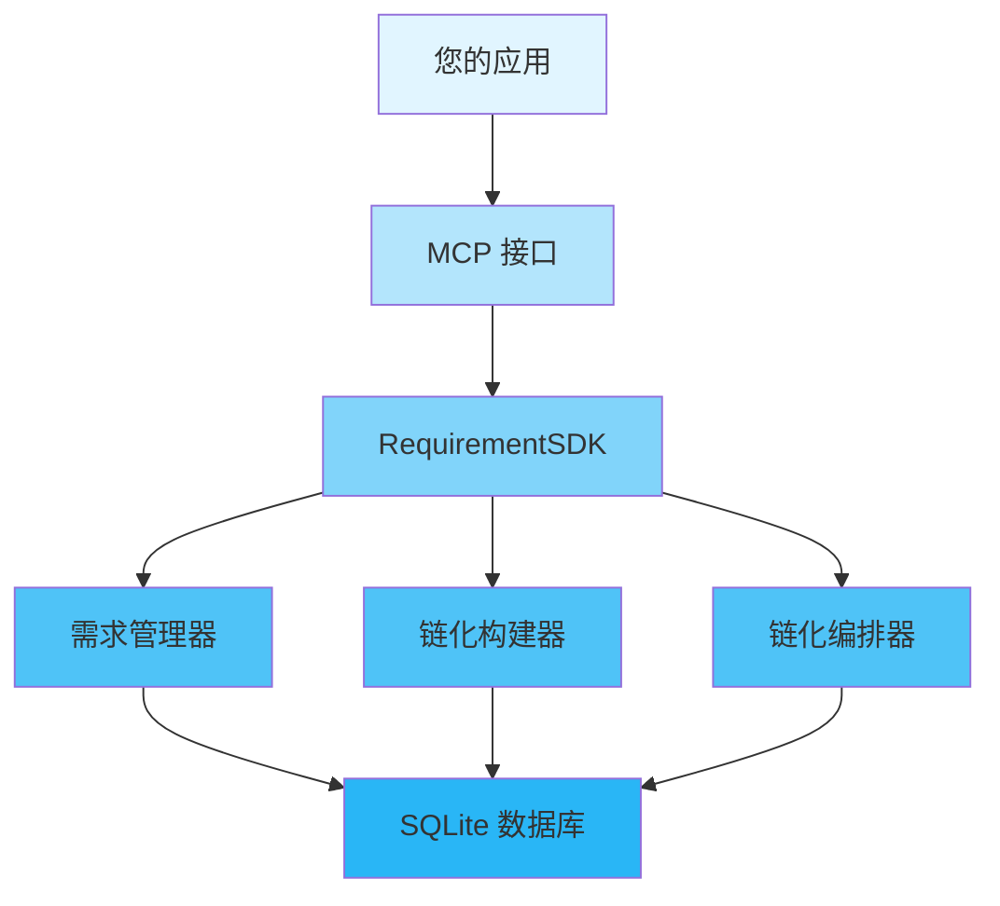

<div align="center">

# 📖 User Guide

### MCP-Axon 需求链化系统完整使用指南

[🏠 Home](../README.md) • [📚 Docs](README.md) • [🎯 Examples](../examples/) • [❓ FAQ](FAQ.md)

---

</div>

## 📋 Table of Contents

- [Introduction](#introduction)
- [Getting Started](#getting-started)
  - [Prerequisites](#prerequisites)
  - [Installation](#installation)
  - [First Steps](#first-steps)
- [Core Concepts](#core-concepts)
- [Basic Usage](#basic-usage)
  - [Initialization](#initialization)
  - [Configuration](#configuration)
  - [Basic Operations](#basic-operations)
- [Advanced Usage](#advanced-usage)
  - [Custom Configuration](#custom-configuration)
  - [Performance Tuning](#performance-tuning)
  - [Error Handling](#error-handling)
- [Best Practices](#best-practices)
- [Common Patterns](#common-patterns)
- [Troubleshooting](#troubleshooting)
- [Next Steps](#next-steps)

---

## Introduction

<div align="center">

### 🎯 What You'll Learn

</div>

<table>
<tr>
<td width="25%" align="center">
<br>
<b>Quick Start</b><br>
Get up and running in 5 minutes
</td>
<td width="25%" align="center">
<br>
<b>Configuration</b><br>
Customize to your needs
</td>
<td width="25%" align="center">
<br>
<b>Best Practices</b><br>
Learn the right way
</td>
<td width="25%" align="center">
<br>
<b>Advanced Topics</b><br>
Master the details
</td>
</tr>
</table>

**MCP-Axon** 是一个基于 Model Context Protocol 的智能需求链化管理系统，旨在帮助您将复杂的需求分解为可执行的链式结构。本指南将带您从基础设置到高级使用，全面掌握需求链化的精髓。

> 💡 **提示**: 本指南假设您具备基本的 Python 编程知识。如果您是需求管理新手，建议先阅读我们的[入门教程](TUTORIALS.md)。

---

## Getting Started

### Prerequisites

在开始之前，请确保您的系统已安装以下组件：

<table>
<tr>
<td width="50%">

**必需组件**
- ✅ Python 3.8+
- ✅ SQLite3 (通常随 Python 安装)
- ✅ Git

</td>
<td width="50%">

**可选组件**
- 🔧 支持 Python 的 IDE (VS Code, PyCharm)
- 🔧 Docker (用于容器化部署)
- 🔧 MCP 客户端 (用于测试)

</td>
</tr>
</table>

<details>
<summary><b>🔍 验证您的安装</b></summary>

```bash
# 检查 Python 版本
python --version
# 预期: Python 3.8.0 或更高

# 检查 SQLite
python -c "import sqlite3; print('SQLite 可用')"
# 预期: SQLite 可用

# 检查 Git 版本
git --version
# 预期: git version 2.x.x
```

</details>

### Installation

<div align="center">

#### 选择您的安装方式

</div>

<table>
<tr>
<td width="50%">

**📦 使用 pip (推荐)**

```bash
# 克隆仓库
git clone https://github.com/Kirky-X/mcp-axon.git
cd mcp-axon

# 安装依赖
pip install -r requirements.txt
```

</td>
<td width="50%">

**🐙 从源码构建**

```bash
# 克隆仓库
git clone https://github.com/Kirky-X/mcp-axon.git
cd mcp-axon

# 设置虚拟环境
python -m venv venv
source venv/bin/activate  # Linux/Mac
# 或 venv\Scripts\activate  # Windows

# 安装依赖
pip install -r requirements.txt
```

</td>
</tr>
</table>

<details>
<summary><b>🌐 Other Installation Methods</b></summary>

**Using Docker**
```bash
docker pull project-name:latest
docker run -it project-name
```

**Using Homebrew (macOS)**
```bash
brew install project-name
```

**Using Chocolatey (Windows)**
```powershell
choco install project-name
```

</details>

### First Steps

让我们通过一个简单的"Hello World"示例来验证您的安装：

```python
from src.core.sdk import RequirementSDK

def main():
    # 初始化 SDK
    sdk = RequirementSDK()
    
    # 创建测试项目
    project = sdk.create_project(
        name="测试项目",
        description="验证安装是否成功"
    )
    
    print(f"✅ MCP-Axon 安装成功!")
    print(f"项目 ID: {project['id']}")
    
    # 获取项目信息
    project_info = sdk.get_project(project['id'])
    print(f"项目名称: {project_info['name']}")

if __name__ == "__main__":
    main()
```

<details>
<summary><b>🎬 运行示例</b></summary>

```bash
# 进入项目目录
cd mcp-axon

# 运行测试脚本
python test_installation.py

# 预期输出:
✅ MCP-Axon 安装成功!
项目 ID: 12345678-1234-1234-1234-123456789012
项目名称: 测试项目
```

</details>

---

## Core Concepts

理解这些核心概念将帮助您有效使用需求链化系统。

<div align="center">

### 🧩 关键组件

</div>



### 1️⃣ 概念一：需求链化

**是什么**: 将复杂需求按照依赖关系分解为可执行的线性链式结构。

**为什么重要**: 确保需求按正确顺序执行，避免依赖冲突，提高执行效率。

**示例:**
```python
# 需求链化示例
sdk = RequirementSDK()

# 添加需求并建立依赖关系
auth_req = sdk.add_requirement(project_id, "用户认证")
db_req = sdk.add_requirement(project_id, "数据库设计")
ui_req = sdk.add_requirement(project_id, "界面设计")

# 添加依赖关系
sdk.add_dependency(ui_req["requirement_id"], auth_req["requirement_id"])
sdk.add_dependency(ui_req["requirement_id"], db_req["requirement_id"])

# 触发链化
chain_result = sdk.trigger_chaining(project_id)
```

<details>
<summary><b>📚 Learn More</b></summary>

Detailed explanation of the concept, including:
- How it works internally
- When to use it
- Common pitfalls
- Related concepts

</details>

### 2️⃣ 概念二：叶子节点

**是什么**: 不需要进一步分解的终端需求节点，可以直接添加验证和执行。

**关键特性:**
- ✅ 可以添加测试用例
- ✅ 可以设置验收标准
- ✅ 参与链化执行

**示例:**
```python
# 叶子节点示例
req_id = sdk.add_requirement(project_id, "实现登录功能")

# 标记为叶子节点
sdk.mark_as_leaf(req_id["requirement_id"])

# 添加验证
sdk.add_validation(
    requirement_id=req_id["requirement_id"],
    test_cases=[{
        "name": "登录测试",
        "steps": ["输入用户名密码", "点击登录"],
        "expected_result": "登录成功"
    }],
    acceptance_criteria="用户能够成功登录系统"
)
```

### 3️⃣ 概念三：并行处理

<table>
<tr>
<td width="50%">

**传统方法**
```python
# 串行执行（低效）
for req in requirements:
    execute_requirement(req)
```

</td>
<td width="50%">

**我们的方法**
```python
# 并行识别和执行
parallel_nodes = detect_parallel_requirements()
sorted_order = resolve_parallel_order(parallel_nodes)
execute_in_order(sorted_order)
```

</td>
</tr>
</table>

---

## Basic Usage

### Initialization

每个应用在使用前都必须初始化 SDK：

```python
from src.core.sdk import RequirementSDK

def main():
    # 简单初始化
    sdk = RequirementSDK()
    
    # 或者指定数据库路径
    sdk = RequirementSDK(db_path="my_requirements.db")
    
    print("✅ SDK 初始化成功")
```

<div align="center">

| 方法 | 使用场景 | 性能 | 复杂度 |
|--------|----------|-------------|------------|
| `RequirementSDK()` | 快速开始，开发 | ⚡ 快速 | 🟢 简单 |
| `RequirementSDK(db_path)` | 生产环境，自定义数据库 | ⚡⚡ 优化 | 🟡 中等 |

</div>

### Configuration

MCP-Axon 提供了灵活的配置选项来满足不同场景的需求。

<details open>
<summary><b>⚙️ 配置选项</b></summary>

```python
from src.core.sdk import RequirementSDK
from src.utils.config import DatabaseConfig

# 数据库配置
db_config = DatabaseConfig(
    database_path="custom.db",
    echo=True,  # 启用 SQL 日志
    pool_size=10  # 连接池大小
)

# 使用自定义配置初始化
sdk = RequirementSDK(
    db_path=db_config.database_path,
    enable_cache=True,
    cache_size=1000
)
```

</details>

<table>
<tr>
<th>选项</th>
<th>类型</th>
<th>默认值</th>
<th>描述</th>
</tr>
<tr>
<td><code>db_path</code></td>
<td>str</td>
<td>"requirements.db"</td>
<td>SQLite 数据库文件路径</td>
</tr>
<tr>
<td><code>enable_cache</code></td>
<td>bool</td>
<td>true</td>
<td>启用结果缓存</td>
</tr>
<tr>
<td><code>cache_size</code></td>
<td>int</td>
<td>1000</td>
<td>缓存大小（MB）</td>
</tr>
<tr>
<td><code>log_level</code></td>
<td>str</td>
<td>"info"</td>
<td>日志级别（debug/info/warn/error）</td>
</tr>
</table>

### Basic Operations

<div align="center">

#### 📝 CRUD 操作

</div>

<table>
<tr>
<td width="50%">

**创建项目**
```python
# 创建项目
project = sdk.create_project(
    name="电商平台",
    description="电商系统需求管理"
)
print(f"项目 ID: {project['id']}")
```

**添加需求**
```python
# 添加根需求
root_req = sdk.add_requirement(
    project_id=project["id"],
    content="用户管理模块"
)
```

</td>
<td width="50%">

**查询项目**
```python
# 获取项目信息
project_info = sdk.get_project(project["id"])
print(f"状态: {project_info['status']}")
```

**更新需求**
```python
# 更新需求内容
sdk.update_requirement(
    requirement_id=root_req["requirement_id"],
    content="用户认证与权限管理"
)
```

</td>
</tr>
</table>

<details>
<summary><b>🎯 完整示例</b></summary>

```python
from src.core.sdk import RequirementSDK

def main():
    # 初始化 SDK
    sdk = RequirementSDK()
    
    # 创建项目
    project = sdk.create_project(
        name="在线教育平台",
        description="教育系统的需求链化管理"
    )
    project_id = project["id"]
    
    # 添加根需求
    user_mgmt = sdk.add_requirement(
        project_id=project_id,
        content="用户管理模块"
    )
    
    # 添加子需求
    auth = sdk.add_requirement(
        project_id=project_id,
        content="用户认证功能",
        parent_id=user_mgmt["requirement_id"]
    )
    
    profile = sdk.add_requirement(
        project_id=project_id,
        content="用户资料管理",
        parent_id=user_mgmt["requirement_id"]
    )
    
    # 标记为叶子节点
    sdk.mark_as_leaf(auth["requirement_id"])
    sdk.mark_as_leaf(profile["requirement_id"])

## Advanced Usage

### Custom Configuration

For production environments, you'll want fine-grained control:

```rust
use project_name::{Config, PerformanceProfile};

let config = Config::builder()
    // Production settings
    .environment("production")
    .performance_profile(PerformanceProfile::HighThroughput)
    
    // Security
    .enable_encryption(true)
    .key_rotation_interval(Duration::from_secs(86400))
    
    // Monitoring
    .enable_metrics(true)
    .metrics_endpoint("http://metrics.example.com")
    
    // Resilience
    .retry_policy(RetryPolicy::exponential_backoff())
    .timeout(Duration::from_secs(30))
    
    .build()?;

init_with_config(config)?;
```

<details>
<summary><b>🎛️ Performance Profiles</b></summary>

<table>
<tr>
<th>Profile</th>
<th>Use Case</th>
<th>Throughput</th>
<th>Latency</th>
<th>Memory</th>
</tr>
<tr>
<td><b>LowLatency</b></td>
<td>Real-time apps</td>
<td>Medium</td>
<td>⚡ Very Low</td>
<td>High</td>
</tr>
<tr>
<td><b>HighThroughput</b></td>
<td>Batch processing</td>
<td>⚡ Very High</td>
<td>Medium</td>
<td>Medium</td>
</tr>
<tr>
<td><b>Balanced</b></td>
<td>General purpose</td>
<td>High</td>
<td>Low</td>
<td>Medium</td>
</tr>
<tr>
<td><b>LowMemory</b></td>
<td>Resource-constrained</td>
<td>Low</td>
<td>Medium</td>
<td>⚡ Very Low</td>
</tr>
</table>

</details>

### Performance Tuning

<div align="center">

#### ⚡ Optimization Strategies

</div>

**1. Connection Pooling**

```rust
let config = Config::builder()
    .connection_pool_size(20)
    .connection_pool_timeout(Duration::from_secs(5))
    .build()?;
```

**2. Batch Operations**

<table>
<tr>
<td width="50%">

❌ **Inefficient**
```rust
for item in items {
    process_one(item)?;
}
```

</td>
<td width="50%">

✅ **Efficient**
```rust
process_batch(&items)?;
```

</td>
</tr>
</table>

**3. Caching**

```rust
use project_name::cache::Cache;

let cache = Cache::builder()
    .max_size(10_000)
    .ttl(Duration::from_secs(3600))
    .build()?;

// Use cache
if let Some(value) = cache.get("key")? {
    return Ok(value);
}

let value = expensive_operation()?;
cache.set("key", value.clone())?;
```

### Error Handling

<div align="center">

#### 🚨 Handling Errors Gracefully

</div>

```rust
use project_name::{Error, ErrorKind};

fn handle_operation() -> Result<(), Error> {
    match risky_operation() {
        Ok(result) => {
            println!("Success: {:?}", result);
            Ok(())
        }
        Err(e) => {
            match e.kind() {
                ErrorKind::NotFound => {
                    println!("⚠️ Resource not found, creating new...");
                    create_resource()?;
                    Ok(())
                }
                ErrorKind::PermissionDenied => {
                    eprintln!("❌ Access denied");
                    Err(e)
                }
                ErrorKind::Timeout => {
                    println!("⏱️ Timeout, retrying...");
                    retry_operation()?;
                    Ok(())
                }
                _ => {
                    eprintln!("❌ Unexpected error: {}", e);
                    Err(e)
                }
            }
        }
    }
}
```

<details>
<summary><b>📋 Error Types</b></summary>

| Error Type | Description | Recovery Strategy |
|------------|-------------|-------------------|
| `NotFound` | Resource doesn't exist | Create or use default |
| `AlreadyExists` | Duplicate resource | Use existing or update |
| `PermissionDenied` | Access violation | Request permissions |
| `Timeout` | Operation took too long | Retry with backoff |
| `InvalidInput` | Bad parameters | Validate and retry |
| `InternalError` | System failure | Log and alert |

</details>

---

## Best Practices

<div align="center">

### 🌟 Follow These Guidelines

</div>

### ✅ DO's

<table>
<tr>
<td width="50%">

**Initialize Early**
```rust
fn main() {
    // Initialize at the start
    project_name::init().unwrap();
    
    // Then use the library
    do_work();
}
```

</td>
<td width="50%">

**Use Builder Pattern**
```rust
let config = Config::builder()
    .option_a(value)
    .option_b(value)
    .build()?;
```

</td>
</tr>
<tr>
<td width="50%">

**Handle Errors Properly**
```rust
match operation() {
    Ok(result) => process(result),
    Err(e) => handle_error(e),
}
```

</td>
<td width="50%">

**Clean Up Resources**
```rust
{
    let resource = acquire()?;
    use_resource(&resource)?;
    // Auto-cleanup on scope exit
}
```

</td>
</tr>
</table>

### ❌ DON'Ts

<table>
<tr>
<td width="50%">

**Don't Ignore Errors**
```rust
// ❌ Bad
let _ = operation();

// ✅ Good
operation()?;
```

</td>
<td width="50%">

**Don't Block Async Context**
```rust
// ❌ Bad (in async fn)
thread::sleep(duration);

// ✅ Good
tokio::time::sleep(duration).await;
```

</td>
</tr>
</table>

### 💡 Tips and Tricks

> **🔥 Performance Tip**: Enable release mode optimizations for production:
> ```bash
> cargo build --release
> ```

> **🔒 Security Tip**: Never hardcode sensitive data:
> ```rust
> // ❌ Bad
> let api_key = "sk-1234567890";
> 
> // ✅ Good
> let api_key = env::var("API_KEY")?;
> ```

> **📊 Monitoring Tip**: Enable metrics in production:
> ```rust
> Config::builder().enable_metrics(true).build()?
> ```

---

## Common Patterns

### Pattern 1: Request-Response

```rust
use project_name::{Request, Response};

fn handle_request(req: Request) -> Result<Response, Error> {
    // Validate
    req.validate()?;
    
    // Process
    let data = process(req.data())?;
    
    // Respond
    Ok(Response::success(data))
}
```

### Pattern 2: Worker Pool

```rust
use project_name::WorkerPool;

let pool = WorkerPool::new(4)?;

for task in tasks {
    pool.execute(move || {
        process_task(task)
    })?;
}

pool.wait_completion()?;
```

### Pattern 3: Pipeline

```rust
use project_name::Pipeline;

let result = Pipeline::new()
    .add_stage(validate)
    .add_stage(transform)
    .add_stage(process)
    .add_stage(store)
    .execute(input)?;
```

---

## Troubleshooting

<details>
<summary><b>❓ Problem: Initialization fails with "already initialized"</b></summary>

**Solution:**
```rust
// Check if already initialized
if !project_name::is_initialized() {
    project_name::init()?;
}
```

</details>

<details>
<summary><b>❓ Problem: Performance is slower than expected</b></summary>

**Diagnosis:**
1. Enable debug logging
2. Check configuration settings
3. Profile your application

**Solution:**
```rust
// Use performance profile
let config = Config::builder()
    .performance_profile(PerformanceProfile::HighThroughput)
    .build()?;
```

</details>

<details>
<summary><b>❓ Problem: Memory usage is high</b></summary>

**Solution:**
```rust
// Reduce cache size
let config = Config::builder()
    .cache_size(512)  // Reduce from default
    .build()?;
```

</details>

<div align="center">

**💬 Still need help?** [Open an issue](../../issues) or [join our Discord](https://discord.gg/project)

</div>

---

## Next Steps

<div align="center">

### 🎯 Continue Your Journey

</div>

<table>
<tr>
<td width="33%" align="center">
<a href="TUTORIALS.md">
<br>
<b>📚 Tutorials</b>
</a><br>
Step-by-step learning
</td>
<td width="33%" align="center">
<a href="ADVANCED.md">
<br>
<b>🔧 Advanced Topics</b>
</a><br>
Deep dive into features
</td>
<td width="33%" align="center">
<a href="../examples/">
<br>
<b>💻 Examples</b>
</a><br>
Real-world code samples
</td>
</tr>
</table>

---

<div align="center">

**[📖 API Reference](https://docs.rs/project-name)** • **[❓ FAQ](FAQ.md)** • **[🐛 Report Issue](../../issues)**

Made with ❤️ by the Project Team

[⬆ Back to Top](#-user-guide)

</div>