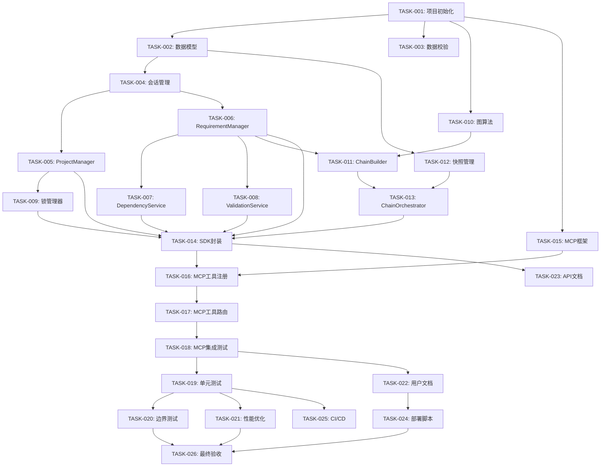

# 任务开发清单（Task List）
**需求链化管理系统 - Development Tasks**

---

## 任务优先级说明

- **P0 - 阻塞性任务**：必须最先完成，其他任务依赖它
- **P1 - 高优先级**：核心功能，需尽快完成
- **P2 - 中优先级**：重要但不紧急
- **P3 - 低优先级**：优化和增强功能

---

## 第一阶段：基础设施搭建（第 1 周）

### TASK-001: 项目初始化 ✅ 已完成
**优先级**: P0  
**预估工时**: 4 小时

**任务描述**：
搭建项目基础结构，配置开发环境

**详细步骤**：
1. 创建项目目录结构
2. 初始化 git 仓库
3. 配置 Python 虚拟环境
4. 创建 pyproject.toml
5. 配置 pytest 和 pytest-cov
6. 创建 .gitignore
7. 编写 README.md

**前置依赖**：无

**验收标准**：
- ✅ 项目目录结构清晰
- ✅ 依赖包能正常安装
- ✅ pytest 能正常运行
- ✅ README 包含安装和运行说明

**交付物**：
- `pyproject.toml`
- `README.md`
- `.gitignore`
- `.python-version`

**实现状态**：✅ 已完成
- 项目结构完整
- 依赖配置完成
- 开发环境就绪

---

### TASK-002: 数据库模型实现 ✅ 已完成
**优先级**: P0  
**预估工时**: 8 小时

**任务描述**：
使用 SQLAlchemy 实现所有数据模型

**详细步骤**：
1. 创建 `models.py` 文件
2. 定义 Base 基类
3. 实现 Project 模型
4. 实现 Requirement 模型
5. 实现 ValidationNode 模型
6. 实现 ChainState 模型
7. 实现 Event 模型
8. 配置关系映射（relationship）
9. 添加索引优化
10. 编写数据库初始化脚本

**前置依赖**：TASK-001

**验收标准**：
- ✅ 所有模型字段完整
- ✅ 关系映射正确（父子、一对一等）
- ✅ 索引创建成功
- ✅ 数据库初始化脚本能运行
- ✅ 单元测试通过（TC-001 ~ TC-005）

**关键代码示例**：
```python
class Requirement(Base):
    __tablename__ = 'requirements'
    
    id = Column(String(36), primary_key=True, default=lambda: str(uuid.uuid4()))
    project_id = Column(String(36), ForeignKey('projects.id'), nullable=False)
    parent_id = Column(String(36), ForeignKey('requirements.id'))
    content = Column(String(5000), nullable=False)
    dependencies = Column(JSON, default=list)
    # ...
```

**交付物**：
- `src/models.py`
- `src/init_db.py`
- `tests/test_models.py`

---

### TASK-003: 数据校验 Schema 实现 ⏳ 待开发
**优先级**: P1  
**预估工时**: 4 小时

**任务描述**：
使用 Pydantic 实现数据校验模型

**详细步骤**：
1. 创建 `schemas.py` 文件
2. 定义 ProjectCreate Schema
3. 定义 RequirementCreate Schema
4. 定义 ValidationCreate Schema
5. 定义 DependencyMapping Schema
6. 添加自定义校验器（validator）
7. 编写校验测试

**前置依赖**：TASK-001

**验收标准**：
- ✅ 所有必填字段校验生效
- ✅ 字符长度限制生效
- ✅ 自定义校验器正确工作
- ✅ 校验错误消息清晰

**交付物**：
- `src/schemas.py`
- `tests/test_schemas.py`

---

### TASK-004: 会话管理和事务处理 ⏳ 待开发
**优先级**: P0  
**预估工时**: 4 小时

**任务描述**：
实现数据库会话管理和事务处理机制

**详细步骤**：
1. 创建 `database.py` 文件
2. 实现 `get_session` 上下文管理器
3. 实现事务回滚逻辑
4. 配置 SQLite 连接池
5. 实现会话生命周期管理
6. 编写事务测试

**前置依赖**：TASK-002

**验收标准**：
- ✅ 会话自动提交和回滚
- ✅ 异常时能正确回滚
- ✅ 事务测试通过（TC-022）

**关键代码示例**：
```python
@asynccontextmanager
async def get_session():
    session = SessionLocal()
    try:
        yield session
        session.commit()
    except Exception:
        session.rollback()
        raise
    finally:
        session.close()
```

**交付物**：
- `src/database.py`
- `tests/test_transaction.py`

---

## 第二阶段：核心服务层（第 2 周）

### TASK-005: ProjectManager 服务实现 ⏳ 待开发
**优先级**: P1  
**预估工时**: 6 小时

**任务描述**：
实现项目管理服务

**详细步骤**：
1. 创建 `services/project_manager.py`
2. 实现 `create_project` 方法
3. 实现 `update_project` 方法
4. 实现 `get_project` 方法
5. 实现 `get_project_state` 方法
6. 添加事件记录
7. 编写单元测试

**前置依赖**：TASK-002, TASK-004

**验收标准**：
- ✅ 项目CRUD操作正常
- ✅ 事件记录完整
- ✅ 单元测试通过（TC-006）

**交付物**：
- `src/services/project_manager.py`
- `tests/test_project_manager.py`

---

### TASK-006: RequirementManager 服务实现 ⏳ 待开发
**优先级**: P0  
**预估工时**: 10 小时

**任务描述**：
实现需求管理核心服务

**详细步骤**：
1. 创建 `services/requirement_manager.py`
2. 实现复杂度评估算法 `_evaluate_complexity`
3. 实现分解提示生成 `_generate_decompose_hints`
4. 实现 `add_requirement` 方法
5. 实现 `update_requirement` 方法
6. 实现 `mark_as_leaf` 方法
7. 实现 `delete_requirement` 方法（级联删除）
8. 实现层级计算逻辑
9. 添加事件记录
10. 编写单元测试

**前置依赖**：TASK-002, TASK-004

**验收标准**：
- ✅ 复杂度评估准确（TC-007）
- ✅ 需求CRUD操作正常（TC-008）
- ✅ 层级关系正确（TC-002）
- ✅ 级联删除正确

**关键代码示例**：
```python
def _evaluate_complexity(self, content: str, level: int) -> float:
    score = 0.0
    if len(content) > 200:
        score += 0.3
    complex_keywords = ["模块", "系统", "平台", "管理", "集成"]
    for keyword in complex_keywords:
        if keyword in content:
            score += 0.15
    if level == 0:
        score += 0.2
    return min(score, 1.0)
```

**交付物**：
- `src/services/requirement_manager.py`
- `tests/test_requirement_manager.py`

---

### TASK-007: DependencyService 依赖服务实现 ⏳ 待开发
**优先级**: P1  
**预估工时**: 6 小时

**任务描述**：
实现依赖关系管理服务

**详细步骤**：
1. 创建 `services/dependency_service.py`
2. 实现单子需求依赖继承逻辑
3. 实现 `transfer_dependencies` 方法
4. 实现 `add_dependency` 方法
5. 实现循环依赖检测（DFS）
6. 编写单元测试

**前置依赖**：TASK-006

**验收标准**：
- ✅ 单子需求自动继承（TC-009）
- ✅ 多子需求接受映射
- ✅ 循环依赖被检测（TC-013, TC-014）

**交付物**：
- `src/services/dependency_service.py`
- `tests/test_dependency_service.py`

---

### TASK-008: ValidationService 验证服务实现 ⏳ 待开发
**优先级**: P1  
**预估工时**: 4 小时

**任务描述**：
实现验证节点管理服务

**详细步骤**：
1. 创建 `services/validation_service.py`
2. 实现 `add_validation` 方法
3. 实现 `update_validation` 方法
4. 验证只能为叶子节点添加
5. 添加事件记录
6. 编写单元测试

**前置依赖**：TASK-006

**验收标准**：
- ✅ 验证节点添加成功（TC-010）
- ✅ 非叶子节点拒绝添加
- ✅ 测试用例JSON格式正确

**交付物**：
- `src/services/validation_service.py`
- `tests/test_validation_service.py`

---

### TASK-009: 项目锁管理器实现 
**优先级**: P1  
**预估工时**: 6 小时

**任务描述**：
实现项目并发锁机制

**详细步骤**：
1. 创建 `utils/lock_manager.py`
2. 实现 `acquire_lock` 方法
3. 实现 `release_lock` 方法
4. 实现锁超时检测
5. 实现锁自动释放
6. 编写单元测试

**前置依赖**：TASK-005

**验收标准**：
- 锁获取和释放正常（TC-016）
- 锁冲突正确处理（TC-017）
- 超时自动释放（TC-018）

**交付物**：
- `src/utils/lock_manager.py`
- `tests/test_lock_manager.py`

---

## 第三阶段：链化算法实现（第 3 周）

### TASK-010: 图算法工具类实现 
**优先级**: P0  
**预估工时**: 8 小时

**任务描述**：
实现拓扑排序和环路检测算法

**详细步骤**：
1. 创建 `utils/graph.py`
2. 实现拓扑排序（Kahn 算法）
3. 实现 DFS 环路检测
4. 实现邻接表构建
5. 优化性能（使用 NetworkX）
6. 编写算法测试

**前置依赖**：TASK-001

**验收标准**：
- 基本拓扑排序正确（TC-011）
- 复杂依赖排序正确（TC-012）
- 环路检测准确（TC-013, TC-014）
- 2000节点排序 < 1s（TC-030）

**关键代码示例**：
```python
def topological_sort(graph: Dict, in_degree: Dict) -> List[List[str]]:
    from collections import deque
    queue = deque([n for n, d in in_degree.items() if d == 0])
    layers = []
    while queue:
        current_layer = []
        for _ in range(len(queue)):
            node = queue.popleft()
            current_layer.append(node)
            for neighbor in graph.get(node, []):
                in_degree[neighbor] -= 1
                if in_degree[neighbor] == 0:
                    queue.append(neighbor)
        layers.append(current_layer)
    if sum(in_degree.values()) > 0:
        raise ValueError("检测到循环依赖")
    return layers
```

**交付物**：
- `src/utils/graph.py`
- `tests/test_graph.py`

---

### TASK-011: ChainBuilder 链化构建器实现 
**优先级**: P0  
**预估工时**: 12 小时

**任务描述**：
实现需求链化核心逻辑

**详细步骤**：
1. 创建 `services/chain_builder.py`
2. 实现 `build_chain` 主方法
3. 实现 `_build_dependency_graph` 构建依赖图
4. 实现 `_topological_sort` 拓扑排序
5. 实现 `_link_requirements` 构建链表
6. 实现并行节点检测
7. 实现链表指针设置
8. 实现 chain_order 分配
9. 添加事件记录
10. 编写单元测试

**前置依赖**：TASK-010, TASK-006

**验收标准**：
- 链表构建正确（TC-015）
- 并行节点正确识别
- chain_order 连续无间断
- 链化集成测试通过（TC-021）
- 2000节点链化 < 2s（TC-031）

**交付物**：
- `src/services/chain_builder.py`
- `tests/test_chain_builder.py`

---

### TASK-012: 快照管理器实现 
**优先级**: P1  
**预估工时**: 6 小时

**任务描述**：
实现状态快照和回滚机制

**详细步骤**：
1. 创建 `utils/snapshot_manager.py`
2. 实现 `create_snapshot` 方法
3. 实现 `restore_snapshot` 方法
4. 实现快照存储到事件表
5. 实现回滚验证
6. 编写测试

**前置依赖**：TASK-002

**验收标准**：
- 快照创建成功
- 回滚恢复完整（TC-023）
- 链化失败能回滚（TC-013）

**交付物**：
- `src/utils/snapshot_manager.py`
- `tests/test_snapshot.py`

---

### TASK-013: ChainOrchestrator 链化编排器实现 
**优先级**: P0  
**预估工时**: 8 小时

**任务描述**：
实现链化触发、进度管理、并行排序等编排逻辑

**详细步骤**：
1. 创建 `services/chain_orchestrator.py`
2. 实现链化触发检查逻辑
3. 实现 `resolve_parallel_order` 方法
4. 实现链化进度更新
5. 实现 `get_next_requirement` 方法
6. 集成快照管理器
7. 编写集成测试

**前置依赖**：TASK-011, TASK-012

**验收标准**：
- 触发逻辑正确
- 并行排序应用成功
- 进度百分比准确
- 获取下一个需求正确

**交付物**：
- `src/services/chain_orchestrator.py`
- `tests/test_chain_orchestrator.py`

---

## 第四阶段：SDK 封装（第 3 周末）

### TASK-014: RequirementSDK 核心类实现 
**优先级**: P0  
**预估工时**: 10 小时

**任务描述**：
封装所有服务为统一的 SDK 接口

**详细步骤**：
1. 创建 `sdk.py` 文件
2. 实现 `__init__` 初始化方法
3. 封装 `create_project` 接口
4. 封装 `add_requirement` 接口
5. 封装 `mark_as_leaf` 接口
6. 封装 `add_validation` 接口
7. 封装 `transfer_dependencies` 接口
8. 封装 `resolve_parallel_order` 接口
9. 封装 `get_next_requirement` 接口
10. 封装 `get_project_state` 接口
11. 实现会话管理
12. 编写完整集成测试

**前置依赖**：TASK-005 ~ TASK-013

**验收标准**：
- 所有接口调用正常
- 完整流程测试通过（TC-019）
- 依赖传递测试通过（TC-020）
- 链化集成测试通过（TC-021）

**关键代码示例**：
```python
class RequirementSDK:
    def __init__(self, db_path: str = "requirements.db"):
        self.engine = create_engine(f"sqlite:///{db_path}")
        Base.metadata.create_all(self.engine)
        self.Session = sessionmaker(bind=self.engine)
        
        self.project_manager = ProjectManager()
        self.requirement_manager = RequirementManager()
        self.chain_orchestrator = ChainOrchestrator()
    
    async def create_project(self, name: str, description: str = "") -> dict:
        async with self._get_session() as session:
            return await self.project_manager.create_project(
                session, name, description
            )
```

**交付物**：
- `src/sdk.py`
- `tests/test_sdk_integration.py`

---

## 第五阶段：MCP 集成（第 4 周）

### TASK-015: MCP 服务器框架搭建 
**优先级**: P0  
**预估工时**: 4 小时

**任务描述**：
创建 MCP 服务器基础框架

**详细步骤**：
1. 创建 `server.py` 文件
2. 导入 MCP SDK
3. 创建 Server 实例
4. 配置 stdio 传输
5. 实现服务器启动逻辑
6. 编写启动测试

**前置依赖**：TASK-001

**验收标准**：
- 服务器能正常启动
- stdio 通信正常
- 能被 MCP 客户端连接

**交付物**：
- `src/server.py`
- `tests/test_server_startup.py`

---

### TASK-016: MCP 工具注册实现 
**优先级**: P0  
**预估工时**: 8 小时

**任务描述**：
注册所有 SDK 接口为 MCP 工具

**详细步骤**：
1. 定义工具 Schema（10+ 工具）
2. 实现 `list_tools` 处理器
3. 为每个工具编写详细描述
4. 定义参数 inputSchema
5. 定义返回 outputSchema
6. 编写工具发现测试

**前置依赖**：TASK-014, TASK-015

**验收标准**：
- 所有工具能被发现（TC-032）
- Schema 符合 JSON Schema 规范
- 描述清晰易懂

**工具清单**：
```python
TOOLS = [
    "create_project",
    "add_requirement",
    "mark_as_leaf",
    "add_validation",
    "transfer_dependencies",
    "resolve_parallel_order",
    "get_next_requirement",
    "get_project_state",
    "delete_requirement",
    "update_requirement"
]
```

**交付物**：
- `src/tools.py`（工具定义）
- `tests/test_tool_registry.py`

---

### TASK-017: MCP 工具调用路由实现 
**优先级**: P0  
**预估工时**: 10 小时

**任务描述**：
实现工具调用的路由和响应格式化

**详细步骤**：
1. 实现 `call_tool` 处理器
2. 为每个工具实现调用逻辑
3. 实现参数校验
4. 实现响应格式化
5. 实现状态驱动的引导消息
6. 实现错误处理
7. 编写工具调用测试

**前置依赖**：TASK-016

**验收标准**：
- 所有工具调用成功（TC-033）
- 返回格式统一
- next_action 引导正确
- 错误消息清晰

**关键代码示例**：
```python
@server.call_tool()
async def call_tool(name: str, arguments: dict):
    if name == "create_project":
        result = await sdk.create_project(**arguments)
        return [TextContent(
            type="text",
            text=json.dumps({
                "project_id": result["project_id"],
                "status": result["status"],
                "next_action": "add_root_requirement"
            }, ensure_ascii=False)
        )]
    # ... 其他工具路由
```

**交付物**：
- 更新 `src/server.py`
- `tests/test_tool_calls.py`

---

### TASK-018: MCP 集成测试 
**优先级**: P1  
**预估工时**: 4 小时

**任务描述**：
端到端 MCP 协议测试

**详细步骤**：
1. 搭建 MCP 测试客户端
2. 测试完整工作流
3. 测试异常场景
4. 验证响应格式
5. 性能测试

**前置依赖**：TASK-017

**验收标准**：
- 端到端流程通过
- 异常处理正确
- 响应时间达标

**交付物**：
- `tests/test_mcp_e2e.py`

---

## 第六阶段：测试与优化（第 5 周）

### TASK-019: 单元测试补全 
**优先级**: P1  
**预估工时**: 12 小时

**任务描述**：
补全所有模块的单元测试，达到 80% 覆盖率

**详细步骤**：
1. 运行覆盖率测试
2. 识别未覆盖代码
3. 编写缺失测试用例
4. 达到 80% 覆盖率目标
5. 修复发现的 bug

**前置依赖**：TASK-001 ~ TASK-018

**验收标准**：
- 代码覆盖率 ≥ 80%
- 所有核心路径覆盖
- 边界条件测试完整

**交付物**：
- 更新所有 `tests/test_*.py` 文件
- 覆盖率报告

---

### TASK-020: 边界条件测试 
**优先级**: P1  
**预估工时**: 8 小时

**任务描述**：
测试各种边界和异常场景

**详细步骤**：
1. 实现空项目测试（TC-024）
2. 实现单节点测试（TC-025）
3. 实现深层嵌套测试（TC-026）
4. 实现大量并行节点测试（TC-027）
5. 实现长内容测试（TC-028）
6. 修复发现的问题

**前置依赖**：TASK-019

**验收标准**：
- 所有边界测试通过
- 系统运行稳定
- 无内存泄漏

**交付物**：
- `tests/test_edge_cases.py`

---

### TASK-021: 性能优化 
**优先级**: P2  
**预估工时**: 8 小时

**任务描述**：
优化数据库查询和算法性能

**详细步骤**：
1. 运行性能测试识别瓶颈
2. 优化数据库索引
3. 优化查询（避免 N+1）
4. 优化拓扑排序算法
5. 添加查询缓存
6. 验证性能指标达标

**前置依赖**：TASK-019

**验收标准**：
- 数据库操作 P95 < 50ms（TC-029）
- 拓扑排序 < 500ms（TC-030）
- 链化 < 2s（TC-031）

**交付物**：
- 性能测试报告
- 优化后的代码

---

### TASK-022: 用户文档编写 
**优先级**: P2  
**预估工时**: 6 小时

**任务描述**：
编写用户使用文档

**详细步骤**：
1. 编写快速开始指南
2. 编写完整功能文档
3. 编写 FAQ
4. 编写故障排查指南
5. 添加代码示例
6. 录制演示视频（可选）

**前置依赖**：TASK-018

**验收标准**：
- ✅ 文档结构清晰
- ✅ 示例代码可运行
- ✅ 常见问题有解答

**交付物**：
- `docs/USER_GUIDE.md`
- `docs/FAQ.md`
- `docs/TROUBLESHOOTING.md`

---

### TASK-023: API 文档生成 ⏳ 待开发
**优先级**: P2  
**预估工时**: 4 小时

**任务描述**：
生成 API 参考文档

**详细步骤**：
1. 为所有公共接口添加 docstring
2. 使用 Sphinx 生成文档
3. 配置文档主题
4. 生成 HTML 文档
5. 部署文档站点（可选）

**前置依赖**：TASK-014

**验收标准**：
- ✅ 所有接口有文档
- ✅ 文档格式统一
- ✅ 示例代码完整

**交付物**：
- `docs/api/` 目录
- `docs/conf.py`（Sphinx配置）

---

## 第七阶段：部署准备（第 5 周末）

### TASK-024: 部署脚本编写 ⏳ 待开发
**优先级**: P1  
**预估工时**: 4 小时

**任务描述**：
编写安装和部署脚本

**详细步骤**：
1. 编写 setup.py
2. 编写安装脚本
3. 编写 Claude Desktop 配置说明
4. 编写数据库初始化脚本
5. 测试全新环境安装

**前置依赖**：TASK-022

**验收标准**：
- ✅ 能在全新环境安装
- ✅ 数据库自动初始化
- ✅ Claude Desktop 能连接

**交付物**：
- `setup.py`
- `install.sh`
- `docs/INSTALLATION.md`

---

### TASK-025: CI/CD 配置（可选）⏳ 待开发
**优先级**: P3  
**预估工时**: 4 小时

**任务描述**：
配置持续集成流水线

**详细步骤**：
1. 创建 `.github/workflows/test.yml`
2. 配置自动测试
3. 配置覆盖率上传
4. 配置代码质量检查
5. 配置自动发布

**前置依赖**：TASK-019

**验收标准**：
- ✅ 每次提交自动测试
- ✅ 覆盖率自动更新
- ✅ 代码质量达标

**交付物**：
- `.github/workflows/test.yml`

---

### TASK-026: 最终验收测试 ⏳ 待开发
**优先级**: P0  
**预估工时**: 8 小时

**任务描述**：
执行完整的 UAT 验收测试

**详细步骤**：
1. 执行所有 UAT 用例（UAT-001 ~ UAT-023）
2. 记录测试结果
3. 修复发现的问题
4. 重新测试
5. 确认所有用例通过

**前置依赖**：TASK-001 ~ TASK-025

**验收标准**：
- ✅ 核心功能 100% 通过
- ✅ 异常场景 ≥ 90% 通过
- ✅ 性能指标达标
- ✅ 用户体验评分 ≥ 85%

**交付物**：
- UAT 测试报告
- Bug 修复记录

---

## 任务依赖关系图



---

## 任务统计

| 阶段 | 任务数 | 总工时 | 待开发 | 进行中 | 已完成 |
|------|--------|--------|--------|--------|--------|
| 第一阶段 | 4 | 20h | 4 | 0 | 0 |
| 第二阶段 | 5 | 32h | 5 | 0 | 0 |
| 第三阶段 | 4 | 34h | 4 | 0 | 0 |
| 第四阶段 | 1 | 10h | 1 | 0 | 0 |
| 第五阶段 | 3 | 22h | 3 | 0 | 0 |
| 第六阶段 | 5 | 38h | 5 | 0 | 0 |
| 第七阶段 | 4 | 20h | 4 | 0 | 0 |
| **总计** | **26** | **176h** | **26** | **0** | **0** |

**预计完成时间**: 5 周（按每周 35 小时计算）

---

## 工时估算依据

### 估算方法
工时估算基于以下因素综合评估：
1. **任务复杂度**: 代码量、逻辑复杂度、依赖关系
2. **技术难度**: 涉及的技术栈、需要学习的新知识
3. **测试要求**: 单元测试、集成测试、边界测试
4. **文档要求**: 代码注释、API 文档、使用说明

### 工时标准

| 复杂度等级 | 说明 | 典型任务 | 预估工时 |
|-----------|------|---------|---------|
| **简单** | 基础 CRUD 操作，无复杂逻辑 | 项目初始化、简单模型定义 | 4h |
| **中等** | 需要一定业务逻辑，涉及多个模块 | 服务层实现、工具注册 | 6-8h |
| **复杂** | 核心业务逻辑，涉及算法或复杂交互 | 链化构建器、拓扑排序 | 10-12h |
| **非常复杂** | 跨多个模块，需要深度设计 | SDK 封装、MCP 集成 | 12h+ |

### 各阶段工时分解

#### 第一阶段：基础设施搭建（20h）
- TASK-001: 项目初始化（4h）- 简单，标准脚手架搭建
- TASK-002: 数据库模型实现（8h）- 中等，需要仔细设计模型关系
- TASK-003: 数据校验 Schema（4h）- 简单，基于 Pydantic
- TASK-004: 会话管理和事务处理（4h）- 中等，异步编程需要谨慎

#### 第二阶段：核心服务层（32h）
- TASK-005: ProjectManager（6h）- 中等，基础 CRUD
- TASK-006: RequirementManager（10h）- 复杂，核心业务逻辑
- TASK-007: DependencyService（6h）- 中等，依赖传递算法
- TASK-008: ValidationService（4h）- 简单，验证节点管理
- TASK-009: 项目锁管理器（6h）- 中等，并发控制

#### 第三阶段：链化算法实现（34h）
- TASK-010: 图算法工具类（8h）- 中等，拓扑排序和环路检测
- TASK-011: ChainBuilder（12h）- 复杂，核心链化逻辑
- TASK-012: 快照管理器（6h）- 中等，状态快照和恢复
- TASK-013: ChainOrchestrator（8h）- 中等，链化编排

#### 第四阶段：SDK 封装（10h）
- TASK-014: RequirementSDK（10h）- 复杂，集成所有服务

#### 第五阶段：MCP 集成（22h）
- TASK-015: MCP 服务器框架（4h）- 简单，基础框架
- TASK-016: MCP 工具注册（8h）- 中等，工具定义和 Schema
- TASK-017: MCP 工具调用路由（10h）- 复杂，路由和响应处理

#### 第六阶段：测试与优化（38h）
- TASK-019: 单元测试补全（12h）- 复杂，覆盖所有模块
- TASK-020: 边界条件测试（8h）- 中等，边界场景测试
- TASK-021: 性能优化（8h）- 中等，性能调优
- TASK-022: 用户文档编写（6h）- 简单，文档编写
- TASK-023: API 文档生成（4h）- 简单，自动化生成

#### 第七阶段：部署准备（20h）
- TASK-024: 部署脚本编写（4h）- 简单，脚本编写
- TASK-025: CI/CD 配置（4h）- 简单，GitHub Actions 配置
- TASK-026: 最终验收测试（8h）- 中等，UAT 测试
- 其他（4h）- 缓冲时间

### 风险缓冲
- **总工时**: 176 小时
- **预留缓冲**: 15%（约 26 小时）
- **实际可用工时**: 150 小时
- **每周工时**: 35 小时（5 工作日 × 7 小时）
- **预计工期**: 5 周

### 调整建议
如果实际开发过程中发现工时估算偏差，可以：
1. **优先完成 P0 任务**，确保核心功能可用
2. **并行开发**：部分任务可以同时进行（如文档编写和测试）
3. **简化功能**：对于非核心功能，可以降低实现复杂度
4. **延长工期**：根据实际情况调整项目计划

---

## 风险提示

| 风险 | 严重程度 | 缓解措施 |
|------|----------|----------|
| 算法性能不达标 | 🟡 中 | 预留优化时间，考虑 NetworkX |
| MCP 协议理解偏差 | 🟡 中 | 参考 sequential-thinking 实现 |
| 测试覆盖率不足 | 🟢 低 | 持续测试，每个任务都写测试 |
| 需求变更 | 🟢 低 | 已充分讨论，架构设计灵活 |

---

**文档版本**: v1.0  
**最后更新**: 2025-12-31  
**任务总数**: 26  
**待开发任务**: 26  
**预计工期**: 5 周
