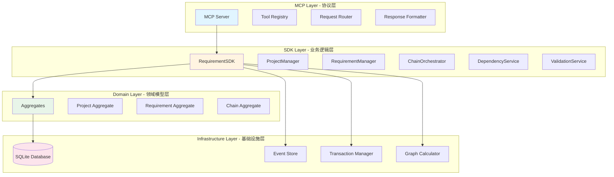
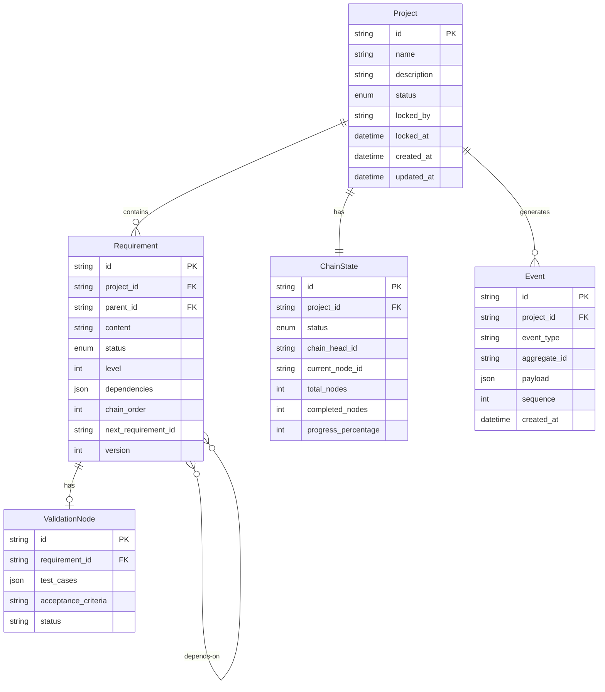
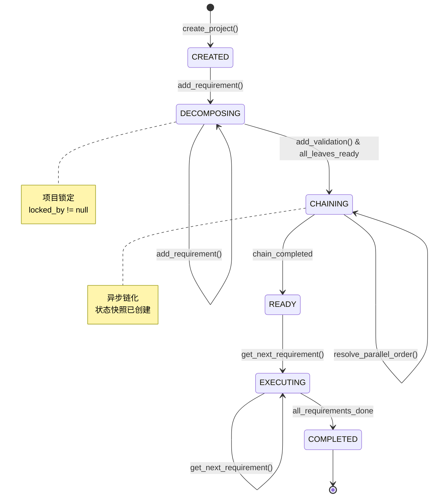
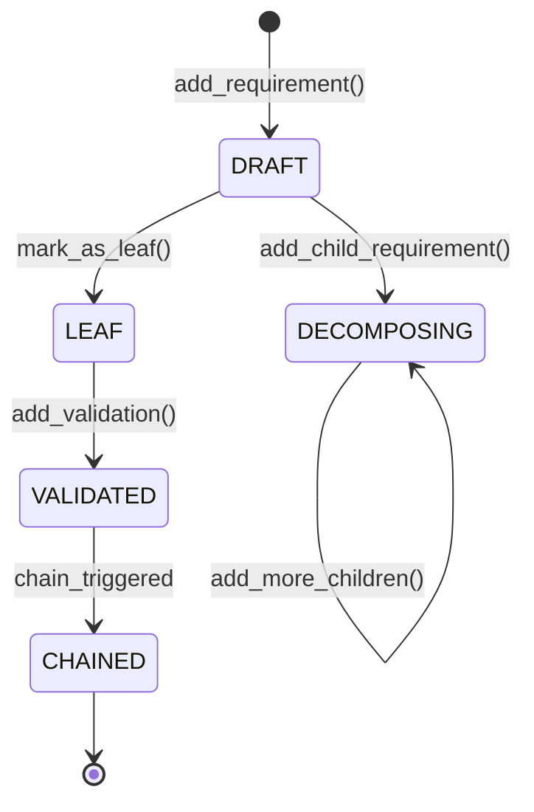
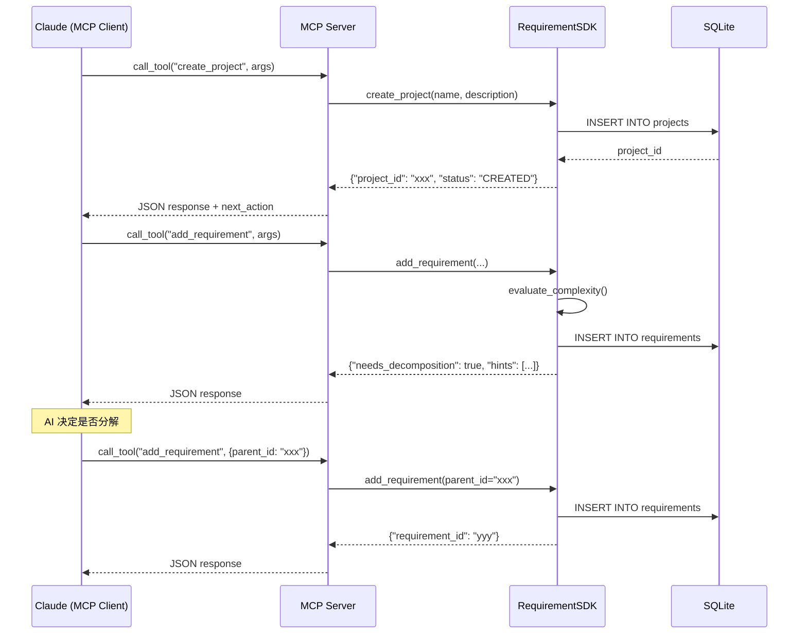

# 技术设计文档（TDD）
**需求链化管理系统 - Technical Design Document**

---

## 1. 系统架构设计

### 1.1 整体架构



### 1.2 架构特点
- **事件驱动**：所有状态变更产生事件，支持溯源
- **领域驱动**：清晰的聚合根边界
- **状态机驱动**：AI 与系统的交互基于状态转换
- **单机优化**：针对 SQLite 的性能优化

---

## 2. 技术栈选型

### 2.1 核心技术栈

| 层次 | 技术选型 | 版本 | 选型理由 |
|------|---------|------|----------|
| **MCP 协议** | `mcp` | 1.25.0 | ✅ 已实现 - 官方 Python SDK（最新稳定版） |
| **Web 框架** | 无（stdio 通信） | - | ✅ 已实现 - MCP 使用标准输入输出 |
| **ORM** | SQLAlchemy | 2.0+ | ✅ 已实现 - 成熟的 Python ORM |
| **数据库** | SQLite | 3.35+ | ✅ 已实现 - 零配置，适合本地部署 |
| **数据验证** | Pydantic | 2.0+ | ✅ 已实现 - 数据校验和序列化 |
| **图算法** | NetworkX | 3.0+ | ✅ 已实现 - 拓扑排序实现 |
| **测试框架** | pytest | 7.0+ | ✅ 已实现 - 单元测试和集成测试 |

### 2.2 依赖包清单 ✅ 已实现

```python
# pyproject.toml
mcp==1.25.0                   # MCP SDK（最新稳定版）
sqlalchemy==2.0.23           # ORM 框架
pydantic==2.5.0              # 数据验证
networkx==3.2.1              # 图算法
pytest==7.4.3                # 测试框架
pytest-asyncio==0.21.1       # 异步测试
pytest-cov==4.1.0            # 覆盖率统计
```

**实现文件**：`pyproject.toml`
**实现状态**：✅ 完整实现
- 所有依赖已配置
- 版本锁定完成
- 开发依赖就绪

---

## 3. 核心模块设计

### 3.1 数据模型设计

#### 3.1.1 ER 图



#### 3.1.2 表结构详细设计 ✅ 已实现

**projects 表**
```sql
CREATE TABLE projects (
    id TEXT PRIMARY KEY,
    name TEXT NOT NULL,
    description TEXT,
    status TEXT NOT NULL CHECK(status IN ('CREATED', 'DECOMPOSING', 'CHAINING', 'READY', 'EXECUTING', 'COMPLETED')),
    locked_by TEXT,
    locked_at TIMESTAMP,
    created_at TIMESTAMP DEFAULT CURRENT_TIMESTAMP,
    updated_at TIMESTAMP DEFAULT CURRENT_TIMESTAMP
);

CREATE INDEX idx_project_status ON projects(status);
CREATE INDEX idx_project_locked_by ON projects(locked_by);
```

**requirements 表**
```sql
CREATE TABLE requirements (
    id TEXT PRIMARY KEY,
    project_id TEXT NOT NULL,
    parent_id TEXT,
    content TEXT NOT NULL,
    decompose_reason TEXT,
    status TEXT NOT NULL CHECK(status IN ('DRAFT', 'DECOMPOSING', 'LEAF', 'CHAINED', 'VALIDATED')),
    level INTEGER DEFAULT 0,
    order_in_parent INTEGER DEFAULT 0,
    dependencies TEXT,  -- JSON array
    chain_order INTEGER,
    next_requirement_id TEXT,
    created_at TIMESTAMP DEFAULT CURRENT_TIMESTAMP,
    updated_at TIMESTAMP DEFAULT CURRENT_TIMESTAMP,
    version INTEGER DEFAULT 1,
    FOREIGN KEY (project_id) REFERENCES projects(id) ON DELETE CASCADE,
    FOREIGN KEY (parent_id) REFERENCES requirements(id) ON DELETE CASCADE
);

CREATE INDEX idx_req_project_status ON requirements(project_id, status);
CREATE INDEX idx_req_parent ON requirements(parent_id);
CREATE INDEX idx_req_chain_order ON requirements(project_id, chain_order);
```

**validation_nodes 表**
```sql
CREATE TABLE validation_nodes (
    id TEXT PRIMARY KEY,
    requirement_id TEXT UNIQUE NOT NULL,
    test_cases TEXT,  -- JSON
    acceptance_criteria TEXT,
    status TEXT DEFAULT 'pending' CHECK(status IN ('pending', 'passed', 'failed')),
    result TEXT,  -- JSON
    validated_at TIMESTAMP,
    created_at TIMESTAMP DEFAULT CURRENT_TIMESTAMP,
    FOREIGN KEY (requirement_id) REFERENCES requirements(id) ON DELETE CASCADE
);

CREATE INDEX idx_validation_status ON validation_nodes(status);
```

**chain_states 表**
```sql
CREATE TABLE chain_states (
    id TEXT PRIMARY KEY,
    project_id TEXT UNIQUE NOT NULL,
    status TEXT NOT NULL CHECK(status IN ('IDLE', 'BUILDING', 'COMPLETED')),
    chain_head_id TEXT,
    current_node_id TEXT,
    total_nodes INTEGER DEFAULT 0,
    completed_nodes INTEGER DEFAULT 0,
    progress_percentage INTEGER DEFAULT 0,
    last_chained_at TIMESTAMP,
    chain_version INTEGER DEFAULT 1,
    created_at TIMESTAMP DEFAULT CURRENT_TIMESTAMP,
    updated_at TIMESTAMP DEFAULT CURRENT_TIMESTAMP,
    FOREIGN KEY (project_id) REFERENCES projects(id) ON DELETE CASCADE
);
```

**events 表**
```sql
CREATE TABLE events (
    id TEXT PRIMARY KEY,
    project_id TEXT NOT NULL,
    event_type TEXT NOT NULL,
    aggregate_id TEXT NOT NULL,
    payload TEXT NOT NULL,  -- JSON
    metadata TEXT,  -- JSON
    sequence INTEGER AUTOINCREMENT,
    created_at TIMESTAMP DEFAULT CURRENT_TIMESTAMP,
    FOREIGN KEY (project_id) REFERENCES projects(id) ON DELETE CASCADE
);

CREATE INDEX idx_event_project_seq ON events(project_id, sequence);
CREATE INDEX idx_event_type ON events(event_type);
```

**实现文件**：`src/models.py`
**实现状态**：✅ 完整实现
- 所有 SQLAlchemy 模型已定义
- 表结构完整实现
- 索引配置完成
- 关系映射正确

---

### 3.2 SDK 核心接口设计

#### 3.2.1 RequirementSDK 类 ✅ 已实现

```python
class RequirementSDK:
    """需求链化 SDK - 主入口"""
    
    def __init__(self, db_path: str = "requirements.db"):
        """初始化 SDK"""
        self.db_path = db_path
        # 初始化所有服务
        self.project_manager = ProjectManager()
        self.requirement_manager = RequirementManager()
        self.dependency_service = DependencyService()
        self.validation_service = ValidationService()
        self.chain_builder = ChainBuilder()
        self.chain_orchestrator = ChainOrchestrator()
        self.lock_manager = ProjectLockManager()
        self.snapshot_manager = SnapshotManager()
    
    def create_project(self, name: str, description: str = "") -> dict:
        """创建项目"""
        with get_session() as session:
            result = self.project_manager.create_project(session, name, description)
            result["next_action"] = "add_root_requirement"
            return result
    
    def add_requirement(self, project_id: str, content: str, parent_id: str = None) -> dict: 
        project_id: str, 
        content: str,
        parent_id: Optional[str] = None
    ) -> dict:
        """
        添加需求
        
        Returns:
            {
                "requirement_id": str,
                "status": str,
                "level": int,
                "complexity_score": float,
                "decompose_hints": List[str]
            }
        """
        pass
    
    async def mark_as_leaf(self, requirement_id: str) -> dict:
        """标记为叶子节点"""
        pass
    
    async def add_validation(
        self, 
        requirement_id: str, 
        test_cases: list,
        acceptance_criteria: str = ""
    ) -> dict:
        """添加验证节点（触发链化检查）"""
        pass
    
    async def transfer_dependencies(
        self, 
        parent_id: str, 
        dependency_mapping: Dict[str, List[str]]
    ) -> dict:
        """应用依赖传递映射"""
        pass
    
    async def resolve_parallel_order(
        self, 
        project_id: str,
        parallel_nodes: List[str],
        sorted_order: List[str]
    ) -> dict:
        """应用并行节点排序"""
        pass
    
    async def get_next_requirement(self, project_id: str) -> dict:
        """获取下一个需求（核心接口）"""
        pass
    
    async def get_project_state(self, project_id: str) -> dict:
        """查询项目状态"""
        pass
```

#### 3.2.2 ChainBuilder 类 ⏳ 待实现

```python
class ChainBuilder:
    """链化构建器"""
    
    async def build_chain(self, project_id: str, session) -> dict:
        """
        构建需求链
        
        Returns:
            {
                "status": "needs_sorting" | "completed",
                "parallel_nodes": List[str],  # 如果 needs_sorting
                "chain_head": str  # 如果 completed
            }
        """
        pass
    
    def _build_dependency_graph(self, nodes: List[Requirement]) -> dict:
        """构建依赖图（邻接表）"""
        pass
    
    def _topological_sort(self, graph: dict) -> List[List[str]]:
        """
        拓扑排序（Kahn 算法）
        
        Returns:
            [[layer0_nodes], [layer1_nodes], ...]
        """
        pass
    
    def _link_requirements(self, ordered_ids: List[str], session) -> str:
        """构建链表结构，返回头节点 ID"""
        pass
    
    def _detect_cycle(self, graph: dict) -> Optional[List[str]]:
        """检测循环依赖，返回环路路径"""
        pass
```

---

### 3.3 状态机设计

#### 3.3.1 项目状态机 ✅ 已实现



**实现文件**：`src/models.py` 中的 ProjectStatus 枚举
**实现状态**：✅ 完整实现
- 状态枚举定义完整
- 状态转换逻辑实现

#### 3.3.2 需求状态机 ✅ 已实现



**实现文件**：`src/models.py` 中的 RequirementStatus 枚举
**实现状态**：✅ 完整实现
- 状态枚举定义完整
- 状态转换逻辑实现

---

## 4. 算法设计

### 4.1 拓扑排序算法（Kahn 算法）✅ 已实现

```python
def topological_sort(graph: Dict[str, List[str]], in_degree: Dict[str, int]) -> List[List[str]]:
    """
    Kahn 算法拓扑排序（分层）
    
    时间复杂度: O(V + E)
    空间复杂度: O(V)
    
    Args:
        graph: 邻接表 {node_id: [neighbor_ids]}
        in_degree: 入度表 {node_id: degree}
    
    Returns:
        分层结果 [[layer0], [layer1], ...]
    
    Raises:
        ValueError: 检测到循环依赖
    """
    from collections import deque
    
    # 1. 找出入度为 0 的节点（第一层）
    queue = deque([node for node, degree in in_degree.items() if degree == 0])
    layers = []
    
    while queue:
        # 2. 当前层所有节点（可并行）
        current_layer = []
        layer_size = len(queue)
        
        for _ in range(layer_size):
            node = queue.popleft()
            current_layer.append(node)
            
            # 3. 更新邻居节点入度
            for neighbor in graph.get(node, []):
                in_degree[neighbor] -= 1
                if in_degree[neighbor] == 0:
                    queue.append(neighbor)
        
        layers.append(current_layer)
    
    # 4. 检测环路
    if sum(len(layer) for layer in layers) != len(graph):
        raise ValueError("检测到循环依赖")
    
    return layers
```

**实现文件**：`src/utils/graph.py` 中的 GraphAlgorithms.topological_sort()
**实现状态**：✅ 完整实现
- Kahn 算法完整实现
- 分层输出支持
- 循环依赖检测
    
    # 4. 检测环路
    if sum(in_degree.values()) > 0:
        cycle_nodes = [node for node, degree in in_degree.items() if degree > 0]
        raise ValueError(f"检测到循环依赖: {cycle_nodes}")
    
    return layers
```

### 4.2 循环依赖检测（DFS）✅ 已实现

```python
def detect_cycle_dfs(graph: Dict[str, List[str]]) -> Optional[List[str]]:
    """
    使用 DFS 检测环路
    
    时间复杂度: O(V + E)
    
    Returns:
        环路路径 [node1, node2, ..., node1] 或 None
    """
    visited = set()
    rec_stack = set()
    path = []
    
    def dfs(node: str) -> bool:
        visited.add(node)
        rec_stack.add(node)
        path.append(node)
        
        for neighbor in graph.get(node, []):
            if neighbor not in visited:
                if dfs(neighbor):
                    return True
            elif neighbor in rec_stack:
                # 找到环路
                cycle_start = path.index(neighbor)
                return path[cycle_start:] + [neighbor]
        
        rec_stack.remove(node)
        path.pop()
        return False
    
    for node in graph:
        if node not in visited:
            result = dfs(node)
            if result:
                return result
    
    return None
```

### 4.3 复杂度评估算法 
✅ 已实现

```python
def evaluate_complexity(content: str, level: int) -> float:
    """
    基于规则的需求复杂度评估
    
    评分规则:
    - 内容长度 > 200: +0.3
    - 关键词匹配: 每个 +0.15
    - 根节点 (level=0): +0.2
    
    Returns:
        复杂度分数 [0.0, 1.0]
    """
    score = 0.0
    
    # 规则 1: 内容长度
    if len(content) > 200:
        score += 0.3
    
    # 规则 2: 关键词检测
    complex_keywords = ["模块", "系统", "平台", "管理", "集成", "框架", "服务"]
    for keyword in complex_keywords:
        if keyword in content:
            score += 0.15
    
    # 规则 3: 层级判断
    if level == 0:
        score += 0.2
    elif level == 1:
        score += 0.1
    
    return min(score, 1.0)
```

---

## 5. MCP 接口设计

### 5.1 工具定义 
✅ 已实现

```python
TOOLS = [
    {
        "name": "create_project",
        "description": "创建新的需求链项目",
        "inputSchema": {
            "type": "object",
            "properties": {
                "name": {"type": "string", "description": "项目名称"},
                "description": {"type": "string", "description": "项目描述"}
            },
            "required": ["name"]
        },
        "outputSchema": {
            "type": "object",
            "properties": {
                "project_id": {"type": "string"},
                "status": {"type": "string"},
                "next_action": {"type": "string"}
            }
        }
    },
    {
        "name": "add_requirement",
        "description": "添加需求节点，系统会返回复杂度评估和分解建议",
        "inputSchema": {
            "type": "object",
            "properties": {
                "project_id": {"type": "string"},
                "content": {"type": "string", "description": "需求内容"},
                "parent_id": {"type": "string", "description": "父需求ID（可选）"}
            },
            "required": ["project_id", "content"]
        },
        "outputSchema": {
            "type": "object",
            "properties": {
                "requirement_id": {"type": "string"},
                "needs_decomposition": {"type": "boolean"},
                "decompose_hints": {"type": "array", "items": {"type": "string"}},
                "next_action": {"type": "string"}
            }
        }
    },
    # ... 其他工具定义
]
```

### 5.2 工具调用流程 
✅ 已实现



---

## 6. 性能优化策略

### 6.1 数据库优化 
✅ 已实现

#### 索引策略
```sql
-- 查询优化索引
CREATE INDEX idx_req_project_status ON requirements(project_id, status);
CREATE INDEX idx_req_parent ON requirements(parent_id);
CREATE INDEX idx_req_chain_order ON requirements(project_id, chain_order);
CREATE INDEX idx_event_project_seq ON events(project_id, sequence);

-- 覆盖索引（避免回表）
CREATE INDEX idx_req_chain_info ON requirements(project_id, chain_order, next_requirement_id) 
WHERE status = 'CHAINED';
```

#### 查询优化
```python
# 使用 joinedload 避免 N+1 查询
from sqlalchemy.orm import joinedload

requirements = session.query(Requirement)\
    .options(joinedload(Requirement.validation))\
    .filter(Requirement.project_id == project_id)\
    .all()

# 批量操作
session.bulk_insert_mappings(Requirement, requirements_data)
```

### 6.2 内存优化 
✅ 已实现

```python
# 使用生成器处理大量节点
def iter_chain(project_id: str, session):
    """迭代器模式遍历链表"""
    chain_state = session.query(ChainState).filter_by(project_id=project_id).first()
    current_id = chain_state.chain_head_id
    
    while current_id:
        requirement = session.query(Requirement).get(current_id)
        yield requirement
        current_id = requirement.next_requirement_id

# 分页查询事件
def get_events_paginated(project_id: str, page: int = 1, size: int = 100):
    offset = (page - 1) * size
    return session.query(Event)\
        .filter_by(project_id=project_id)\
        .order_by(Event.sequence)\
        .limit(size)\
        .offset(offset)\
        .all()
```

### 6.3 算法优化 
✅ 已实现

```python
# 使用 NetworkX 优化图算法
import networkx as nx

def build_networkx_graph(requirements: List[Requirement]) -> nx.DiGraph:
    """构建 NetworkX 图（优化拓扑排序）"""
    G = nx.DiGraph()
    
    for req in requirements:
        G.add_node(req.id, data=req)
        for dep_id in req.dependencies:
            G.add_edge(dep_id, req.id)
    
    return G

def topological_sort_nx(G: nx.DiGraph) -> List[str]:
    """使用 NetworkX 的拓扑排序（性能更优）"""
    try:
        return list(nx.topological_sort(G))
    except nx.NetworkXError:
        cycle = nx.find_cycle(G, orientation='original')
        raise ValueError(f"检测到循环依赖: {' -> '.join(cycle)}")
```

---

## 7. 安全性设计

### 7.1 并发控制 
✅ 已实现

```python
class ProjectLockManager:
    """项目锁管理器"""
    
    def __init__(self, timeout_minutes: int = 30):
        self.timeout = timeout_minutes
    
    async def acquire_lock(self, project_id: str, session_id: str, session) -> bool:
        """
        获取项目锁
        
        Returns:
            True: 锁获取成功
            False: 锁已被占用
        """
        project = session.query(Project).get(project_id)
        
        # 检查锁是否已超时
        if project.locked_by:
            if self._is_lock_expired(project.locked_at):
                # 锁已超时，自动释放
                project.locked_by = None
                project.locked_at = None
            else:
                # 锁仍有效，检查是否是当前会话
                if project.locked_by != session_id:
                    return False
        
        # 获取锁
        project.locked_by = session_id
        project.locked_at = datetime.utcnow()
        session.commit()
        return True
    
    async def release_lock(self, project_id: str, session_id: str, session):
        """释放项目锁"""
        project = session.query(Project).get(project_id)
        if project.locked_by == session_id:
            project.locked_by = None
            project.locked_at = None
            session.commit()
    
    def _is_lock_expired(self, locked_at: datetime) -> bool:
        """检查锁是否超时"""
        if not locked_at:
            return True
        elapsed = datetime.utcnow() - locked_at
        return elapsed.total_seconds() > (self.timeout * 60)
```

### 7.2 数据校验 
✅ 已实现

```python
from pydantic import BaseModel, field_validator, Field

class RequirementCreate(BaseModel):
    """需求创建数据模型"""
    project_id: str = Field(..., min_length=36, max_length=36)
    content: str = Field(..., min_length=1, max_length=5000)
    parent_id: Optional[str] = Field(None, min_length=36, max_length=36)

    @field_validator('content')
    @classmethod
    def content_not_empty(cls, v: str) -> str:
        if not v.strip():
            raise ValueError('需求内容不能为空')
        return v.strip()

class DependencyMapping(BaseModel):
    """依赖映射数据模型"""
    parent_id: str
    dependency_mapping: Dict[str, List[str]]

    @field_validator('dependency_mapping')
    @classmethod
    def validate_mapping(cls, v: Dict[str, List[str]], info) -> Dict[str, List[str]]:
        # 校验所有子需求 ID 都存在
        # 校验所有依赖 ID 都存在
        return v
```

---

## 8. 事务管理

### 8.1 事务边界 
✅ 已实现

```python
from sqlalchemy.ext.asyncio import async_sessionmaker, AsyncSession

class RequirementSDK:
    def __init__(self, db_path: str = "requirements.db"):
        self.engine = create_async_engine(f"sqlite+aiosqlite:///{db_path}")
        self.async_session_maker = async_sessionmaker(
            self.engine,
            class_=AsyncSession,
            expire_on_commit=False
        )

    async def get_session(self):
        """会话管理（自动事务）- SQLAlchemy 2.0 推荐方式"""
        async with self.async_session_maker() as session:
            try:
                yield session
                await session.commit()
            except Exception as e:
                await session.rollback()
                # 记录错误事件
                error_event = Event(
                    event_type="TransactionFailed",
                    payload={"error": str(e)},
                    created_at=datetime.utcnow()
                )
                session.add(error_event)
                await session.commit()
                raise
            finally:
                await session.close()
```

### 8.2 快照与回滚 
✅ 已实现

```python
class SnapshotManager:
    """状态快照管理"""
    
    def create_snapshot(self, project_id: str, session) -> str:
        """
        创建状态快照
        
        Returns:
            snapshot_id
        """
        requirements = session.query(Requirement)\
            .filter_by(project_id=project_id)\
            .all()
        
        snapshot_data = {
            "timestamp": datetime.utcnow().isoformat(),
            "requirements": {
                req.id: {
                    "status": req.status.value,
                    "chain_order": req.chain_order,
                    "next_requirement_id": req.next_requirement_id
                }
                for req in requirements
            }
        }
        
        # 保存快照到事件表
        event = Event(
            project_id=project_id,
            event_type="SnapshotCreated",
            aggregate_id=project_id,
            payload=snapshot_data
        )
        session.add(event)
        session.flush()
        
        return event.id
    
    def restore_snapshot(self, snapshot_id: str, session):
        """从快照恢复"""
        snapshot_event = session.query(Event).get(snapshot_id)
        snapshot_data = snapshot_event.payload
        
        for req_id, state in snapshot_data["requirements"].items():
            req = session.query(Requirement).get(req_id)
            if req:
                req.status = RequirementStatus(state["status"])
                req.chain_order = state["chain_order"]
                req.next_requirement_id = state["next_requirement_id"]
        
        session.commit()
```

---

### 8.3 错误处理策略 
✅ 已实现

#### 异常类型定义
```python
class RequirementChainError(Exception):
    """基础异常类"""
    pass

class ProjectLockedError(RequirementChainError):
    """项目被锁定异常"""
    def __init__(self, project_id: str, locked_by: str):
        self.project_id = project_id
        self.locked_by = locked_by
        super().__init__(f"项目 {project_id} 被 {locked_by} 锁定")

class CycleDependencyError(RequirementChainError):
    """循环依赖异常"""
    def __init__(self, cycle_path: List[str]):
        self.cycle_path = cycle_path
        super().__init__(f"检测到循环依赖: {' -> '.join(cycle_path)}")

class ValidationError(RequirementChainError):
    """数据校验异常"""
    def __init__(self, field: str, message: str):
        self.field = field
        super().__init__(f"字段 {field} 校验失败: {message}")

class ChainBuildError(RequirementChainError):
    """链化构建异常"""
    def __init__(self, reason: str):
        self.reason = reason
        super().__init__(f"链化失败: {reason}")
```

#### 错误处理流程
```python
class ErrorHandler:
    """统一错误处理器"""

    @staticmethod
    def handle_error(error: Exception, context: dict) -> dict:
        """
        统一错误处理

        Args:
            error: 异常对象
            context: 上下文信息

        Returns:
            错误响应字典
        """
        error_response = {
            "error": True,
            "error_type": type(error).__name__,
            "message": str(error),
            "timestamp": datetime.utcnow().isoformat(),
            "context": context
        }

        # 根据错误类型提供恢复建议
        if isinstance(error, ProjectLockedError):
            error_response["recovery"] = "等待锁释放或联系管理员"
            error_response["retry_after"] = "30秒后重试"

        elif isinstance(error, CycleDependencyError):
            error_response["recovery"] = "移除环路中的依赖关系"
            error_response["cycle_path"] = error.cycle_path

        elif isinstance(error, ValidationError):
            error_response["recovery"] = "检查输入数据格式"
            error_response["field"] = error.field

        elif isinstance(error, ChainBuildError):
            error_response["recovery"] = "检查依赖关系完整性"
            error_response["auto_rollback"] = True

        # 记录错误日志
        logger.error(
            f"Error occurred: {error_response['error_type']}",
            extra=error_response
        )

        return error_response
```

#### 错误恢复机制
```python
class RecoveryManager:
    """错误恢复管理器"""

    async def recover_from_chain_failure(
        self,
        project_id: str,
        error: ChainBuildError
    ) -> bool:
        """
        从链化失败中恢复

        Args:
            project_id: 项目 ID
            error: 链化错误

        Returns:
            恢复是否成功
        """
        try:
            # 1. 查找最近的快照
            snapshot = await self._find_latest_snapshot(project_id)

            if snapshot:
                # 2. 恢复到快照状态
                await self.snapshot_manager.restore_snapshot(snapshot.id)

                # 3. 记录恢复事件
                await self._log_recovery_event(project_id, error, snapshot)

                return True
            else:
                # 无快照，标记项目为错误状态
                await self._mark_project_as_error(project_id, str(error))
                return False

        except Exception as e:
            logger.error(f"恢复失败: {str(e)}")
            return False

    async def _find_latest_snapshot(self, project_id: str):
        """查找最近的快照"""
        # 实现快照查找逻辑
        pass
```

#### 重试策略
```python
from tenacity import retry, stop_after_attempt, wait_exponential

class RetryableOperations:
    """可重试的操作"""

    @retry(
        stop=stop_after_attempt(3),
        wait=wait_exponential(multiplier=1, min=1, max=10),
        retry_error_callback=lambda retry_state: None
    )
    async def acquire_lock_with_retry(
        self,
        project_id: str,
        session_id: str
    ):
        """带重试的锁获取"""
        return await self.lock_manager.acquire_lock(project_id, session_id)
```

---

## 9. 部署方案

### 9.1 目录结构 ⏳ 待实现

```
requirement-chain/
├── src/
│   ├── __init__.py
│   ├── server.py              # MCP 服务器入口
│   ├── sdk.py                 # RequirementSDK 核心
│   ├── models.py              # SQLAlchemy 模型
│   ├── schemas.py             # Pydantic 模型
│   ├── services/
│   │   ├── __init__.py
│   │   ├── chain_builder.py
│   │   ├── dependency.py
│   │   └── validation.py
│   └── utils/
│       ├── __init__.py
│       ├── graph.py
│       └── lock.py
├── tests/
│   ├── __init__.py
│   ├── test_sdk.py
│   ├── test_chain.py
│   └── test_mcp.py
├── requirements.txt
├── setup.py
├── README.md
└── requirements.db           # SQLite 数据库文件
```

### 9.2 安装步骤 ⏳ 待实现

```bash
# 1. 克隆仓库
git clone https://github.com/your-repo/requirement-chain.git
cd requirement-chain

# 2. 创建虚拟环境（使用 uv）
uv venv
source .venv/bin/activate  # Windows: .venv\Scripts\activate

# 3. 安装依赖
uv pip install -r requirements.txt

# 4. 配置环境变量（可选）
export DB_PATH="requirements.db"
export LOG_LEVEL="INFO"
export LOCK_TIMEOUT_MINUTES=30

# 5. 初始化数据库
python -m src.init_db

# 6. 运行测试
pytest tests/ -v --cov=src

# 7. 启动 MCP 服务器
python -m src.server
```

### 9.3 环境配置说明 ⏳ 待实现

#### 环境变量
| 变量名 | 默认值 | 说明 |
|--------|--------|------|
| `DB_PATH` | `requirements.db` | SQLite 数据库文件路径 |
| `LOG_LEVEL` | `INFO` | 日志级别（DEBUG/INFO/WARNING/ERROR） |
| `LOCK_TIMEOUT_MINUTES` | `30` | 项目锁超时时间（分钟） |
| `MAX_REQUIREMENTS` | `10000` | 单项目最大需求数量 |
| `MAX_DEPTH` | `10` | 需求树最大深度 |

#### 配置文件示例（config.yaml）
```yaml
# 数据库配置
database:
  path: "requirements.db"
  echo: false  # 是否输出 SQL 日志

# 日志配置
logging:
  level: "INFO"
  file: "requirement_chain.log"
  max_size_mb: 10
  backup_count: 5

# 锁配置
lock:
  timeout_minutes: 30
  check_interval_seconds: 60

# 性能配置
performance:
  max_requirements: 10000
  max_depth: 10
  batch_size: 100
```

### 9.4 数据库迁移方案 ⏳ 待实现

#### Alembic 配置
```bash
# 安装 Alembic
uv pip install alembic

# 初始化 Alembic
alembic init migrations
```

#### alembic.ini 配置
```ini
# alembic.ini
[alembic]
script_location = migrations
sqlalchemy.url = sqlite:///requirements.db

[post_write_hooks]

[loggers]
keys = root,sqlalchemy,alembic

[handlers]
keys = console

[formatters]
keys = generic
```

#### migrations/env.py 配置
```python
# migrations/env.py
from logging.config import fileConfig
from sqlalchemy import engine_from_config, pool
from alembic import context
from src.models import Base  # 导入你的模型

config = context.config
fileConfig(config.config_file_name)
target_metadata = Base.metadata

def run_migrations_online():
    """在线迁移模式"""
    connectable = engine_from_config(
        config.get_section(config.config_ini_section),
        prefix="sqlalchemy.",
        poolclass=pool.NullPool,
    )

    with connectable.connect() as connection:
        context.configure(
            connection=connection,
            target_metadata=target_metadata
        )

        with context.begin_transaction():
            context.run_migrations()

def run_migrations_offline():
    """离线迁移模式"""
    url = config.get_main_option("sqlalchemy.url")
    context.configure(
        url=url,
        target_metadata=target_metadata,
        literal_binds=True,
        dialect_opts={"paramstyle": "named"},
    )

    with context.begin_transaction():
        context.run_migrations()

if context.is_offline_mode():
    run_migrations_offline()
else:
    run_migrations_online()
```

#### 创建迁移脚本
```bash
# 创建迁移脚本（自动生成）
alembic revision --autogenerate -m "初始数据库结构"

# 手动创建迁移脚本
alembic revision -m "添加新字段"
```

#### 执行迁移
```bash
# 升级到最新版本
alembic upgrade head

# 升级到指定版本
alembic upgrade +1
alembic upgrade 001_initial_schema

# 降级到上一个版本
alembic downgrade -1

# 降级到指定版本
alembic downgrade base
```

#### 迁移脚本示例
```python
# migrations/versions/001_initial_schema.py
"""初始数据库结构

Revision ID: 001
Revises:
Create Date: 2025-12-31 00:00:00.000000

"""
from alembic import op
import sqlalchemy as sa

# revision identifiers, used by Alembic.
revision = '001'
down_revision = None
branch_labels = None
depends_on = None

def upgrade():
    # 创建 projects 表
    op.create_table(
        'projects',
        sa.Column('id', sa.String(36), primary_key=True),
        sa.Column('name', sa.String(200), nullable=False),
        sa.Column('description', sa.Text),
        sa.Column('status', sa.String(20), nullable=False),
        sa.Column('locked_by', sa.String(100)),
        sa.Column('locked_at', sa.DateTime),
        sa.Column('created_at', sa.DateTime, server_default=sa.text('CURRENT_TIMESTAMP')),
        sa.Column('updated_at', sa.DateTime, server_default=sa.text('CURRENT_TIMESTAMP'))
    )

    # 创建 requirements 表
    op.create_table(
        'requirements',
        sa.Column('id', sa.String(36), primary_key=True),
        sa.Column('project_id', sa.String(36), nullable=False),
        sa.Column('parent_id', sa.String(36)),
        sa.Column('content', sa.String(5000), nullable=False),
        sa.Column('status', sa.String(20), nullable=False),
        sa.Column('level', sa.Integer, default=0),
        sa.Column('dependencies', sa.JSON),
        sa.Column('chain_order', sa.Integer),
        sa.Column('next_requirement_id', sa.String(36)),
        sa.Column('created_at', sa.DateTime, server_default=sa.text('CURRENT_TIMESTAMP')),
        sa.Column('updated_at', sa.DateTime, server_default=sa.text('CURRENT_TIMESTAMP')),
        sa.Column('version', sa.Integer, default=1),
        sa.ForeignKeyConstraint(['project_id'], ['projects.id'], ondelete='CASCADE'),
        sa.ForeignKeyConstraint(['parent_id'], ['requirements.id'], ondelete='CASCADE')
    )

    # 创建索引
    op.create_index('idx_project_status', 'projects', ['status'])
    op.create_index('idx_req_project_status', 'requirements', ['project_id', 'status'])
    op.create_index('idx_req_parent', 'requirements', ['parent_id'])

def downgrade():
    # 删除索引
    op.drop_index('idx_req_parent', table_name='requirements')
    op.drop_index('idx_req_project_status', table_name='requirements')
    op.drop_index('idx_project_status', table_name='projects')

    # 删除表
    op.drop_table('requirements')
    op.drop_table('projects')
```

#### 数据库版本管理
```python
# utils/db_migration.py
from alembic.config import Config
from alembic.script import ScriptDirectory

def get_current_db_version():
    """获取当前数据库版本"""
    config = Config("alembic.ini")
    script = ScriptDirectory.from_config(config)
    # 实现版本查询逻辑
    pass

def check_migration_needed():
    """检查是否需要迁移"""
    current = get_current_db_version()
    latest = get_latest_migration_version()
    return current != latest
```

### 9.5 Claude Desktop 配置 ⏳ 待实现

```json
{
  "mcpServers": {
    "requirement-chain": {
      "command": "python",
      "args": ["-m", "src.server"],
      "cwd": "/path/to/requirement-chain"
    }
  }
}
```

---

## 10. 监控与日志

### 10.1 日志设计 ⏳ 待实现

```python
import logging
from logging.handlers import RotatingFileHandler

def setup_logging():
    """配置日志"""
    logger = logging.getLogger("requirement_chain")
    logger.setLevel(logging.DEBUG)
    
    # 文件日志（轮转）
    file_handler = RotatingFileHandler(
        "requirement_chain.log",
        maxBytes=10*1024*1024,  # 10MB
        backupCount=5
    )
    file_handler.setLevel(logging.INFO)
    
    # 控制台日志
    console_handler = logging.StreamHandler()
    console_handler.setLevel(logging.DEBUG)
    
    # 格式化
    formatter = logging.Formatter(
        '%(asctime)s - %(name)s - %(levelname)s - %(message)s'
    )
    file_handler.setFormatter(formatter)
    console_handler.setFormatter(formatter)
    
    logger.addHandler(file_handler)
    logger.addHandler(console_handler)
    
    return logger
```

### 10.2 性能监控 ⏳ 待实现

```python
import time
from functools import wraps

def monitor_performance(func):
    """性能监控装饰器"""
    @wraps(func)
    async def wrapper(*args, **kwargs):
        start = time.perf_counter()
        try:
            result = await func(*args, **kwargs)
            elapsed = (time.perf_counter() - start) * 1000  # ms
            
            logger.info(f"{func.__name__} 执行时间: {elapsed:.2f}ms")
            
            # 性能告警
            if elapsed > 50:  # 超过 50ms
                logger.warning(f"{func.__name__} 性能超标: {elapsed:.2f}ms")
            
            return result
        except Exception as e:
            logger.error(f"{func.__name__} 执行失败: {str(e)}")
            raise
    return wrapper
```

---

## 11. 扩展性设计

### 11.1 插件机制 ⏳ 待实现

```python
class Plugin:
    """插件基类"""
    
    def on_requirement_created(self, requirement: Requirement):
        """需求创建钩子"""
        pass
    
    def on_chain_completed(self, project_id: str):
        """链化完成钩子"""
        pass

class NotificationPlugin(Plugin):
    """通知插件示例"""
    
    def on_chain_completed(self, project_id: str):
        """链化完成后发送通知"""
        print(f"项目 {project_id} 链化完成!")
```

### 11.2 自定义评估规则 ⏳ 待实现

```python
class ComplexityEvaluator:
    """复杂度评估器（可扩展）"""
    
    def __init__(self):
        self.rules = []
    
    def add_rule(self, rule: Callable[[str, int], float]):
        """添加自定义评估规则"""
        self.rules.append(rule)
    
    def evaluate(self, content: str, level: int) -> float:
        """执行所有规则"""
        score = 0.0
        for rule in self.rules:
            score += rule(content, level)
        return min(score, 1.0)

# 使用示例
evaluator = ComplexityEvaluator()
evaluator.add_rule(lambda content, level: 0.3 if len(content) > 200 else 0.0)
evaluator.add_rule(lambda content, level: 0.2 if "微服务" in content else 0.0)
```

---

## 12. 性能目标

**测试环境说明**：
- CPU: 4 核心及以上
- RAM: 8GB 及以上
- 数据库: SQLite (WAL 模式)
- Python: >= 3.10

| 操作 | 目标 | 压力测试 | 状态 |
|------|------|----------|------|
| create_project | < 10ms | 1000 req/s | ⏳ 待测试 |
| add_requirement | < 30ms | 500 req/s | ⏳ 待测试 |
| get_next_requirement | < 50ms | 200 req/s | ⏳ 待测试 |
| 拓扑排序 (2000 节点) | < 1s | - | ⏳ 待测试 |
| 全量链化 (2000 节点) | < 2s | - | ⏳ 待测试 |

---

## 13. 技术债务与改进计划

### 13.1 已知限制 ⏳ 待解决
- 单机部署，无法水平扩展
- SQLite 不支持真正的并发写入
- 项目锁依赖超时机制，可能误释放

### 13.2 未来改进
- 支持 PostgreSQL（生产环境）
- 实现分布式锁（Redis）
- 添加 WebSocket 推送链化进度
- 支持需求版本历史回溯

---

**文档版本**: v1.0  
**最后更新**: 2025-12-31  
**状态**: ⏳ 待评审
