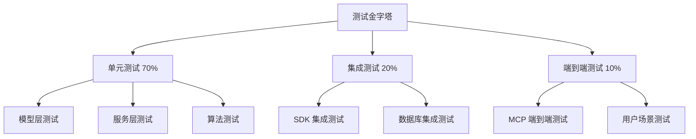

# 测试文档（Test Document）
**需求链化管理系统 - Test Plan**

---

## 1. 测试策略概述

### 1.1 测试目标
- 验证所有功能需求正确实现
- 确保系统性能达标（数据库操作 < 50ms）
- 验证数据一致性和事务完整性
- 测试异常场景和边界条件

### 1.2 测试层次



### 1.3 测试环境
- **Python 版本**: 3.10+
- **测试框架**: pytest 7.4+
- **覆盖率工具**: pytest-cov
- **数据库**: SQLite (内存模式用于测试)
- **Mock 工具**: unittest.mock

### 1.4 测试数据策略
- 使用 fixture 提供可复用的测试数据
- 每个测试用例独立的数据库实例（内存 SQLite）
- 使用 factory 模式生成测试实体

---

## 2. 单元测试用例

### 2.1 数据模型层测试

#### TC-001: Project 模型创建 ⏳ 待测试
**测试目标**: 验证项目模型能正确创建并保存

```python
def test_create_project():
    """测试创建项目"""
    # Arrange
    project = Project(
        name="测试项目",
        description="这是一个测试项目"
    )
    
    # Act
    session.add(project)
    session.commit()
    
    # Assert
    assert project.id is not None
    assert project.status == ProjectStatus.CREATED
    assert project.locked_by is None
    assert project.created_at is not None
```

**预期结果**: 项目创建成功，ID 自动生成，状态为 CREATED

---

#### TC-002: Requirement 模型层级关系 ⏳ 待测试
**测试目标**: 验证需求父子关系正确建立

```python
def test_requirement_hierarchy():
    """测试需求层级关系"""
    # Arrange
    parent = Requirement(
        project_id=project.id,
        content="父需求",
        level=0
    )
    child = Requirement(
        project_id=project.id,
        parent_id=parent.id,
        content="子需求",
        level=1
    )
    
    # Act
    session.add_all([parent, child])
    session.commit()
    
    # Assert
    assert child.parent_id == parent.id
    assert child.level == parent.level + 1
    assert parent.children[0].id == child.id
```

**预期结果**: 父子关系正确，层级自动计算

---

#### TC-003: Requirement 依赖关系 ⏳ 待测试
**测试目标**: 验证依赖关系 JSON 存储和读取

```python
def test_requirement_dependencies():
    """测试依赖关系存储"""
    # Arrange
    req1 = Requirement(project_id=project.id, content="需求1")
    req2 = Requirement(project_id=project.id, content="需求2")
    req3 = Requirement(
        project_id=project.id,
        content="需求3",
        dependencies=[req1.id, req2.id]
    )
    
    # Act
    session.add_all([req1, req2, req3])
    session.commit()
    
    # Assert
    assert len(req3.dependencies) == 2
    assert req1.id in req3.dependencies
    assert req2.id in req3.dependencies
```

**预期结果**: 依赖关系正确存储为 JSON 数组

---

#### TC-004: ValidationNode 唯一性约束 ⏳ 待测试
**测试目标**: 验证一个需求只能有一个验证节点

```python
def test_validation_node_uniqueness():
    """测试验证节点唯一性"""
    # Arrange
    requirement = Requirement(project_id=project.id, content="叶子需求")
    validation1 = ValidationNode(requirement_id=requirement.id)
    validation2 = ValidationNode(requirement_id=requirement.id)
    
    # Act & Assert
    session.add_all([requirement, validation1])
    session.commit()
    
    with pytest.raises(IntegrityError):
        session.add(validation2)
        session.commit()
```

**预期结果**: 第二个验证节点插入失败，抛出唯一性约束异常

---

#### TC-005: ChainState 级联删除 ⏳ 待测试
**测试目标**: 验证删除项目时链状态自动删除

```python
def test_chain_state_cascade_delete():
    """测试链状态级联删除"""
    # Arrange
    project = Project(name="测试项目")
    chain_state = ChainState(project_id=project.id)
    session.add_all([project, chain_state])
    session.commit()
    
    # Act
    session.delete(project)
    session.commit()
    
    # Assert
    assert session.query(ChainState).filter_by(project_id=project.id).first() is None
```

**预期结果**: 项目删除后，链状态自动删除

---

### 2.2 服务层测试

#### TC-006: ProjectManager 创建项目 ⏳ 待测试
**测试目标**: 验证项目管理服务正确创建项目

```python
async def test_project_manager_create():
    """测试项目管理器创建项目"""
    # Arrange
    manager = ProjectManager(session)
    
    # Act
    result = await manager.create_project(
        name="测试项目",
        description="描述"
    )
    
    # Assert
    assert result["project_id"] is not None
    assert result["status"] == "CREATED"
    
    # 验证数据库
    project = session.query(Project).get(result["project_id"])
    assert project is not None
    assert project.name == "测试项目"
```

**预期结果**: 项目创建成功，返回正确的数据结构

---

#### TC-007: RequirementManager 复杂度评估 ⏳ 待测试
**测试目标**: 验证需求复杂度评估算法

```python
def test_complexity_evaluation():
    """测试复杂度评估"""
    # Arrange
    manager = RequirementManager(session)
    
    # Test Case 1: 简单需求
    simple_content = "实现用户登录"
    score1 = manager._evaluate_complexity(simple_content, level=1)
    assert score1 < 0.5
    
    # Test Case 2: 复杂需求
    complex_content = "实现完整的用户管理模块系统，包括用户注册、登录、权限控制、角色管理等功能，并集成第三方认证平台"
    score2 = manager._evaluate_complexity(complex_content, level=0)
    assert score2 > 0.7
    
    # Test Case 3: 关键词匹配
    keyword_content = "设计微服务架构的API网关模块"
    score3 = manager._evaluate_complexity(keyword_content, level=0)
    assert score3 > 0.5
```

**预期结果**: 
- 简单需求 < 0.5
- 复杂需求 > 0.7
- 关键词匹配正确加分

---

#### TC-008: RequirementManager 添加需求 ⏳ 待测试
**测试目标**: 验证添加需求功能完整性

```python
async def test_add_requirement():
    """测试添加需求"""
    # Arrange
    manager = RequirementManager(session)
    project = Project(name="测试项目")
    session.add(project)
    session.commit()
    
    # Act
    result = await manager.add_requirement(
        project_id=project.id,
        content="实现用户管理模块系统",
        parent_id=None
    )
    
    # Assert
    assert result["requirement_id"] is not None
    assert result["level"] == 0
    assert result["complexity_score"] > 0.0
    assert "decompose_hints" in result
    
    # 验证数据库
    req = session.query(Requirement).get(result["requirement_id"])
    assert req.project_id == project.id
    assert req.status == RequirementStatus.DRAFT
```

**预期结果**: 需求添加成功，复杂度评估正确，返回分解提示

---

#### TC-009: DependencyService 单子需求继承 ⏳ 待测试
**测试目标**: 验证单子需求自动继承父依赖

```python
async def test_dependency_single_child_inheritance():
    """测试单子需求依赖继承"""
    # Arrange
    service = DependencyService(session)
    parent = Requirement(
        project_id=project.id,
        content="父需求",
        dependencies=["dep1", "dep2"]
    )
    child = Requirement(
        project_id=project.id,
        parent_id=parent.id,
        content="子需求"
    )
    session.add_all([parent, child])
    session.commit()
    
    # Act
    result = await service.transfer_dependencies(
        parent_id=parent.id,
        children_ids=[child.id]
    )
    
    # Assert
    session.refresh(child)
    assert child.dependencies == ["dep1", "dep2"]
```

**预期结果**: 单子需求自动继承所有父依赖

---

#### TC-010: ValidationService 添加验证 ⏳ 待测试
**测试目标**: 验证为叶子节点添加验证功能

```python
async def test_add_validation():
    """测试添加验证节点"""
    # Arrange
    service = ValidationService(session)
    requirement = Requirement(
        project_id=project.id,
        content="叶子需求",
        status=RequirementStatus.LEAF
    )
    session.add(requirement)
    session.commit()
    
    test_cases = [
        {
            "name": "测试用户注册",
            "steps": ["打开页面", "输入信息", "提交"],
            "expected": "注册成功"
        }
    ]
    
    # Act
    result = await service.add_validation(
        requirement_id=requirement.id,
        test_cases=test_cases
    )
    
    # Assert
    assert result["validation_id"] is not None
    
    # 验证数据库
    validation = session.query(ValidationNode).filter_by(
        requirement_id=requirement.id
    ).first()
    assert validation is not None
    assert len(validation.test_cases) == 1
```

**预期结果**: 验证节点创建成功，测试用例正确存储

---

### 2.3 算法测试

#### TC-011: 拓扑排序 - 基本场景 ⏳ 待测试
**测试目标**: 验证基本拓扑排序功能

```python
def test_topological_sort_basic():
    """测试基本拓扑排序"""
    # Arrange
    graph = {
        "A": ["B", "C"],
        "B": ["D"],
        "C": ["D"],
        "D": []
    }
    in_degree = {"A": 0, "B": 1, "C": 1, "D": 2}
    
    # Act
    layers = topological_sort(graph, in_degree)
    
    # Assert
    assert layers[0] == ["A"]
    assert set(layers[1]) == {"B", "C"}
    assert layers[2] == ["D"]
```

**预期结果**: 
- 第0层: [A]
- 第1层: [B, C] (并行)
- 第2层: [D]

---

#### TC-012: 拓扑排序 - 复杂依赖 ⏳ 待测试
**测试目标**: 验证复杂依赖关系的拓扑排序

```python
def test_topological_sort_complex():
    """测试复杂拓扑排序"""
    # Arrange
    graph = {
        "req1": ["req2", "req3"],
        "req2": ["req4"],
        "req3": ["req4", "req5"],
        "req4": ["req6"],
        "req5": ["req6"],
        "req6": []
    }
    in_degree = {
        "req1": 0, "req2": 1, "req3": 1,
        "req4": 2, "req5": 1, "req6": 2
    }
    
    # Act
    layers = topological_sort(graph, in_degree)
    
    # Assert
    assert len(layers) == 4
    assert layers[0] == ["req1"]
    assert "req6" in layers[-1]
```

**预期结果**: 排序成功，层级正确

---

#### TC-013: 循环依赖检测 ⏳ 待测试
**测试目标**: 验证能检测简单环路

```python
def test_cycle_detection():
    """测试循环依赖检测"""
    # Arrange
    graph = {
        "A": ["B"],
        "B": ["C"],
        "C": ["A"]  # 环路
    }
    in_degree = {"A": 1, "B": 1, "C": 1}
    
    # Act & Assert
    with pytest.raises(ValueError, match="循环依赖"):
        topological_sort(graph, in_degree)
```

**预期结果**: 抛出循环依赖异常

---

#### TC-014: DFS 环路检测 ⏳ 待测试
**测试目标**: 验证 DFS 能找到环路路径

```python
def test_dfs_cycle_detection():
    """测试 DFS 环路检测"""
    # Arrange
    graph = {
        "A": ["B"],
        "B": ["C"],
        "C": ["D"],
        "D": ["B"]  # B -> C -> D -> B
    }
    
    # Act
    cycle = detect_cycle_dfs(graph)
    
    # Assert
    assert cycle is not None
    assert "B" in cycle
    assert cycle[0] == cycle[-1]  # 环路首尾相同
```

**预期结果**: 返回环路路径 [B, C, D, B]

---

#### TC-015: 链表构建 ⏳ 待测试
**测试目标**: 验证链表结构正确构建

```python
def test_build_linked_list():
    """测试链表构建"""
    # Arrange
    builder = ChainBuilder()
    requirements = [
        Requirement(id="req1", content="需求1"),
        Requirement(id="req2", content="需求2"),
        Requirement(id="req3", content="需求3")
    ]
    session.add_all(requirements)
    session.commit()
    
    ordered_ids = ["req1", "req2", "req3"]
    
    # Act
    head_id = builder._link_requirements(ordered_ids, session)
    
    # Assert
    assert head_id == "req1"
    
    req1 = session.query(Requirement).get("req1")
    assert req1.chain_order == 0
    assert req1.next_requirement_id == "req2"
    
    req3 = session.query(Requirement).get("req3")
    assert req3.chain_order == 2
    assert req3.next_requirement_id is None
```

**预期结果**: 链表指针正确，chain_order 连续

---

### 2.4 锁机制测试

#### TC-016: 项目锁获取 ⏳ 待测试
**测试目标**: 验证项目锁能正确获取

```python
async def test_acquire_project_lock():
    """测试获取项目锁"""
    # Arrange
    lock_manager = ProjectLockManager()
    project = Project(name="测试项目")
    session.add(project)
    session.commit()
    
    # Act
    result = await lock_manager.acquire_lock(
        project_id=project.id,
        session_id="session1",
        session=session
    )
    
    # Assert
    assert result is True
    session.refresh(project)
    assert project.locked_by == "session1"
    assert project.locked_at is not None
```

**预期结果**: 锁获取成功，locked_by 正确设置

---

#### TC-017: 项目锁冲突 ⏳ 待测试
**测试目标**: 验证锁冲突时拒绝第二个会话

```python
async def test_lock_conflict():
    """测试锁冲突"""
    # Arrange
    lock_manager = ProjectLockManager()
    project = Project(name="测试项目")
    session.add(project)
    session.commit()
    
    # Act
    await lock_manager.acquire_lock(project.id, "session1", session)
    result = await lock_manager.acquire_lock(project.id, "session2", session)
    
    # Assert
    assert result is False
```

**预期结果**: 第二个会话获取锁失败

---

#### TC-018: 锁超时释放 ⏳ 待测试
**测试目标**: 验证锁超时后自动释放

```python
async def test_lock_timeout():
    """测试锁超时"""
    # Arrange
    lock_manager = ProjectLockManager(timeout_minutes=0.001)  # 0.06秒超时
    project = Project(name="测试项目")
    session.add(project)
    session.commit()
    
    # Act
    await lock_manager.acquire_lock(project.id, "session1", session)
    await asyncio.sleep(0.1)  # 等待超时
    
    result = await lock_manager.acquire_lock(project.id, "session2", session)
    
    # Assert
    assert result is True
    session.refresh(project)
    assert project.locked_by == "session2"
```

**预期结果**: 超时后锁自动释放，新会话能获取锁

---

## 3. 集成测试场景

### 3.1 SDK 集成测试

#### TC-019: 完整需求管理流程 ⏳ 待测试
**测试目标**: 验证创建项目 -> 添加需求 -> 标记叶子 -> 添加验证的完整流程

```python
async def test_full_requirement_flow():
    """测试完整需求管理流程"""
    # Arrange
    sdk = RequirementSDK(db_path=":memory:")
    
    # Act & Assert
    # 1. 创建项目
    project_result = await sdk.create_project("测试项目")
    assert project_result["status"] == "CREATED"
    project_id = project_result["project_id"]
    
    # 2. 添加根需求
    req_result = await sdk.add_requirement(
        project_id=project_id,
        content="实现用户管理模块"
    )
    assert req_result["needs_decomposition"] is True
    
    # 3. 添加子需求
    child1 = await sdk.add_requirement(
        project_id=project_id,
        content="用户注册",
        parent_id=req_result["requirement_id"]
    )
    
    # 4. 标记为叶子
    leaf_result = await sdk.mark_as_leaf(child1["requirement_id"])
    assert leaf_result["status"] == "leaf"
    
    # 5. 添加验证
    validation_result = await sdk.add_validation(
        requirement_id=child1["requirement_id"],
        test_cases=[{"name": "测试注册"}]
    )
    assert validation_result["validation_id"] is not None
```

**预期结果**: 所有步骤成功，数据一致

---

#### TC-020: 依赖传递集成测试 ⏳ 待测试
**测试目标**: 验证需求分解后的依赖传递

```python
async def test_dependency_transfer_integration():
    """测试依赖传递集成"""
    # Arrange
    sdk = RequirementSDK(db_path=":memory:")
    project = await sdk.create_project("测试项目")
    
    # 创建依赖需求
    dep1 = await sdk.add_requirement(project["project_id"], "依赖1")
    await sdk.mark_as_leaf(dep1["requirement_id"])
    
    # 创建父需求（依赖 dep1）
    parent = await sdk.add_requirement(
        project["project_id"],
        "父需求"
    )
    # 手动设置依赖（模拟 AI 决策）
    # ... (直接操作数据库设置 dependencies)
    
    # 创建子需求
    child1 = await sdk.add_requirement(
        project["project_id"],
        "子需求1",
        parent_id=parent["requirement_id"]
    )
    child2 = await sdk.add_requirement(
        project["project_id"],
        "子需求2",
        parent_id=parent["requirement_id"]
    )
    
    # Act: 传递依赖
    await sdk.transfer_dependencies(
        parent_id=parent["requirement_id"],
        dependency_mapping={
            child1["requirement_id"]: [dep1["requirement_id"]],
            child2["requirement_id"]: []
        }
    )
    
    # Assert
    # 验证依赖正确传递
    # ...
```

**预期结果**: 依赖关系正确传递到子需求

---

#### TC-021: 链化集成测试 ⏳ 待测试
**测试目标**: 验证完整链化流程

```python
async def test_chain_integration():
    """测试链化集成"""
    # Arrange
    sdk = RequirementSDK(db_path=":memory:")
    project = await sdk.create_project("测试项目")
    project_id = project["project_id"]
    
    # 创建多个叶子需求
    reqs = []
    for i in range(5):
        req = await sdk.add_requirement(project_id, f"需求{i}")
        await sdk.mark_as_leaf(req["requirement_id"])
        await sdk.add_validation(
            req["requirement_id"],
            test_cases=[{"name": f"测试{i}"}]
        )
        reqs.append(req)
    
    # 设置依赖关系: req1 -> req0, req2 -> req1
    # ... (直接操作数据库)
    
    # Act: 触发链化
    next_req = await sdk.get_next_requirement(project_id)
    
    # Assert
    assert next_req["status"] == "ready" or next_req["status"] == "needs_sorting"
    
    # 如果需要排序
    if next_req["status"] == "needs_sorting":
        await sdk.resolve_parallel_order(
            project_id=project_id,
            parallel_nodes=next_req["parallel_nodes"],
            sorted_order=next_req["parallel_nodes"]
        )
        
        next_req = await sdk.get_next_requirement(project_id)
        assert next_req["status"] == "ready"
```

**预期结果**: 链化成功，能获取到第一个需求

---

### 3.2 数据库事务测试

#### TC-022: 事务回滚测试 ⏳ 待测试
**测试目标**: 验证操作失败时事务正确回滚

```python
async def test_transaction_rollback():
    """测试事务回滚"""
    # Arrange
    sdk = RequirementSDK(db_path=":memory:")
    project = await sdk.create_project("测试项目")
    
    # Act: 尝试为非叶子节点添加验证（应失败）
    req = await sdk.add_requirement(project["project_id"], "非叶子需求")
    
    with pytest.raises(ValueError):
        await sdk.add_validation(
            requirement_id=req["requirement_id"],
            test_cases=[{"name": "测试"}]
        )
    
    # Assert: 验证节点未创建
    with sdk._get_session() as session:
        validation = session.query(ValidationNode).filter_by(
            requirement_id=req["requirement_id"]
        ).first()
        assert validation is None
```

**预期结果**: 操作失败，数据库状态未改变

---

#### TC-023: 快照与恢复测试 ⏳ 待测试
**测试目标**: 验证链化失败时能恢复到快照

```python
async def test_snapshot_restore():
    """测试快照恢复"""
    # Arrange
    sdk = RequirementSDK(db_path=":memory:")
    project = await sdk.create_project("测试项目")
    
    # 创建需求并链化
    req1 = await sdk.add_requirement(project["project_id"], "需求1")
    await sdk.mark_as_leaf(req1["requirement_id"])
    await sdk.add_validation(req1["requirement_id"], [{"name": "测试"}])
    
    # 模拟链化失败
    # ... (注入失败逻辑)
    
    # Act: 尝试链化（应失败并回滚）
    # ...
    
    # Assert: 验证状态恢复
    # ...
```

**预期结果**: 失败后状态恢复到链化前

---

## 4. 边界条件测试

#### TC-024: 空项目链化 ⏳ 待测试
**测试目标**: 验证空项目（无需求）时的链化行为

```python
async def test_empty_project_chain():
    """测试空项目链化"""
    # Arrange
    sdk = RequirementSDK(db_path=":memory:")
    project = await sdk.create_project("空项目")
    
    # Act
    result = await sdk.get_next_requirement(project["project_id"])
    
    # Assert
    assert result["status"] == "completed" or "message" in result
```

**预期结果**: 返回已完成状态或提示无需求

---

#### TC-025: 单节点项目 ⏳ 待测试
**测试目标**: 验证只有一个需求的项目

```python
async def test_single_requirement_project():
    """测试单需求项目"""
    # Arrange
    sdk = RequirementSDK(db_path=":memory:")
    project = await sdk.create_project("单需求项目")
    
    req = await sdk.add_requirement(project["project_id"], "唯一需求")
    await sdk.mark_as_leaf(req["requirement_id"])
    await sdk.add_validation(req["requirement_id"], [{"name": "测试"}])
    
    # Act
    next_req = await sdk.get_next_requirement(project["project_id"])
    
    # Assert
    assert next_req["status"] == "ready"
    assert next_req["requirement"]["id"] == req["requirement_id"]
```

**预期结果**: 能正确返回唯一需求

---

#### TC-026: 深层嵌套需求 ⏳ 待测试
**测试目标**: 验证 10 层深度的需求树

```python
async def test_deep_nested_requirements():
    """测试深层嵌套"""
    # Arrange
    sdk = RequirementSDK(db_path=":memory:")
    project = await sdk.create_project("深层项目")
    
    parent_id = None
    for i in range(10):
        req = await sdk.add_requirement(
            project["project_id"],
            f"需求层级{i}",
            parent_id=parent_id
        )
        parent_id = req["requirement_id"]
    
    # Act
    await sdk.mark_as_leaf(parent_id)
    
    # Assert
    with sdk._get_session() as session:
        leaf = session.query(Requirement).get(parent_id)
        assert leaf.level == 9
```

**预期结果**: 支持 10 层深度，层级正确

---

#### TC-027: 大量并行节点 ⏳ 待测试
**测试目标**: 验证 100 个并行节点的排序

```python
async def test_many_parallel_nodes():
    """测试大量并行节点"""
    # Arrange
    sdk = RequirementSDK(db_path=":memory:")
    project = await sdk.create_project("并行项目")
    
    # 创建 100 个无依赖的叶子节点
    req_ids = []
    for i in range(100):
        req = await sdk.add_requirement(project["project_id"], f"需求{i}")
        await sdk.mark_as_leaf(req["requirement_id"])
        await sdk.add_validation(req["requirement_id"], [{"name": f"测试{i}"}])
        req_ids.append(req["requirement_id"])
    
    # Act
    result = await sdk.get_next_requirement(project["project_id"])
    
    # Assert
    assert result["status"] == "needs_sorting"
    assert len(result["parallel_nodes"]) == 100
```

**预期结果**: 能正确识别 100 个并行节点

---

#### TC-028: 长内容需求 ⏳ 待测试
**测试目标**: 验证 5000 字符的需求内容

```python
async def test_long_content_requirement():
    """测试长内容需求"""
    # Arrange
    sdk = RequirementSDK(db_path=":memory:")
    project = await sdk.create_project("长内容项目")
    
    long_content = "需求内容" * 625  # 5000字符
    
    # Act
    req = await sdk.add_requirement(project["project_id"], long_content)
    
    # Assert
    assert req["requirement_id"] is not None
    
    with sdk._get_session() as session:
        saved_req = session.query(Requirement).get(req["requirement_id"])
        assert len(saved_req.content) == 5000
```

**预期结果**: 支持 5000 字符内容存储

---

## 5. 性能测试计划

### 5.1 数据库性能测试 ⏳ 待测试

#### TC-029: CRUD 操作性能
**测试目标**: 验证数据库操作 < 50ms

```python
async def test_crud_performance():
    """测试 CRUD 性能"""
    sdk = RequirementSDK(db_path="test.db")
    project = await sdk.create_project("性能测试")
    
    # 测试创建性能
    start = time.perf_counter()
    for _ in range(100):
        await sdk.add_requirement(project["project_id"], "需求")
    elapsed = (time.perf_counter() - start) * 1000 / 100
    
    assert elapsed < 50  # 平均 < 50ms
```

**预期结果**: 平均每次操作 < 50ms

---

#### TC-030: 拓扑排序性能 ⏳ 待测试
**测试目标**: 验证 2000 节点排序 < 1s

```python
def test_topological_sort_performance():
    """测试拓扑排序性能"""
    # 构建 2000 节点的图
    graph = {}
    in_degree = {}
    for i in range(2000):
        graph[f"node{i}"] = [f"node{i+1}"] if i < 1999 else []
        in_degree[f"node{i}"] = 1 if i > 0 else 0

    # 测试性能
    start = time.perf_counter()
    layers = topological_sort(graph, in_degree)
    elapsed = (time.perf_counter() - start) * 1000

    assert elapsed < 1000  # < 1s
```

**预期结果**: 2000 节点排序 < 500ms

---

#### TC-031: 链化性能 ⏳ 待测试
**测试目标**: 验证 2000 节点链化 < 2s

```python
async def test_chain_performance():
    """测试链化性能"""
    sdk = RequirementSDK(db_path=":memory:")
    project = await sdk.create_project("性能测试")
    
    # 创建 2000 个叶子节点
    for i in range(2000):
        req = await sdk.add_requirement(project["project_id"], f"需求{i}")
        await sdk.mark_as_leaf(req["requirement_id"])
        await sdk.add_validation(req["requirement_id"], [{"name": f"测试{i}"}])
    
    # 测试链化性能
    start = time.perf_counter()
    await sdk.get_next_requirement(project["project_id"])
    elapsed = (time.perf_counter() - start) * 1000
    
    assert elapsed < 2000  # < 2s
```

**预期结果**: 2000 节点链化 < 2s

---

## 6. 端到端测试

### 6.1 MCP 协议测试

#### TC-032: MCP 工具注册测试 ⏳ 待测试
**测试目标**: 验证所有工具能被 MCP 客户端发现

```python
async def test_mcp_tool_registration():
    """测试 MCP 工具注册"""
    # Arrange
    server = RequirementMCPServer()
    
    # Act
    tools = await server.server.list_tools()
    
    # Assert
    tool_names = [tool.name for tool in tools]
    assert "create_project" in tool_names
    assert "add_requirement" in tool_names
    assert "get_next_requirement" in tool_names
    assert len(tool_names) >= 8
```

**预期结果**: 所有核心工具都被注册

---

#### TC-033: MCP 工具调用测试 ⏳ 待测试
**测试目标**: 验证 MCP 工具能正确调用

```python
async def test_mcp_tool_call():
    """测试 MCP 工具调用"""
    # Arrange
    server = RequirementMCPServer()
    
    # Act
    result = await server.server.call_tool(
        "create_project",
        {"name": "测试项目", "description": "描述"}
    )
    
    # Assert
    assert result is not None
    content = json.loads(result.content[0].text)
    assert "project_id" in content
    assert "next_action" in content
```

**预期结果**: 工具调用成功，返回正确格式

---

### 6.2 用户场景测试

#### TC-034: 电商系统需求管理场景 ⏳ 待测试
**测试目标**: 模拟完整的电商系统需求管理流程

```python
async def test_ecommerce_scenario():
    """测试电商系统场景"""
    sdk = RequirementSDK(db_path=":memory:")
    
    # 1. 创建项目
    project = await sdk.create_project("电商系统")
    
    # 2. 添加根需求
    root = await sdk.add_requirement(project["project_id"], "电商系统开发")
    
    # 3. 分解为模块
    user_module = await sdk.add_requirement(
        project["project_id"], "用户模块", parent_id=root["requirement_id"]
    )
    order_module = await sdk.add_requirement(
        project["project_id"], "订单模块", parent_id=root["requirement_id"]
    )
    
    # 4. 用户模块进一步分解
    register = await sdk.add_requirement(
        project["project_id"], "用户注册", parent_id=user_module["requirement_id"]
    )
    login = await sdk.add_requirement(
        project["project_id"], "用户登录", parent_id=user_module["requirement_id"]
    )
    
    # 5. 标记叶子并添加验证
    await sdk.mark_as_leaf(register["requirement_id"])
    await sdk.add_validation(register["requirement_id"], [{"name": "测试注册"}])
    
    await sdk.mark_as_leaf(login["requirement_id"])
    await sdk.add_validation(login["requirement_id"], [{"name": "测试登录"}])
    
    # 6. 设置依赖（登录依赖注册）
    await sdk.transfer_dependencies(
        user_module["requirement_id"],
        {
            login["requirement_id"]: [register["requirement_id"]]
        }
    )
    
    # 7. 触发链化
    next_req = await sdk.get_next_requirement(project["project_id"])
    
    # Assert
    assert next_req["status"] in ["ready", "needs_sorting"]
```

**预期结果**: 完整场景无报错，链化成功

---

## 7. 测试覆盖率目标

| 模块 | 目标覆盖率 | 当前覆盖率 | 优先级 | 测试用例数 | 状态 |
|------|-----------|-----------|--------|-----------|------|
| models.py | 90% | 0% | 高 | 5 | ⏳ 待测试 |
| sdk.py | 85% | 0% | 高 | 10 | ⏳ 待测试 |
| services/project_manager.py | 85% | 0% | 高 | 6 | ⏳ 待测试 |
| services/requirement_manager.py | 85% | 0% | 高 | 12 | ⏳ 待测试 |
| services/chain_builder.py | 80% | 0% | 高 | 8 | ⏳ 待测试 |
| services/dependency_service.py | 80% | 0% | 中 | 5 | ⏳ 待测试 |
| services/validation_service.py | 80% | 0% | 中 | 4 | ⏳ 待测试 |
| utils/graph.py | 80% | 0% | 高 | 6 | ⏳ 待测试 |
| utils/lock_manager.py | 75% | 0% | 中 | 4 | ⏳ 待测试 |
| utils/snapshot_manager.py | 75% | 0% | 中 | 3 | ⏳ 待测试 |
| server.py | 70% | 0% | 中 | 8 | ⏳ 待测试 |
| schemas.py | 90% | 0% | 中 | 5 | ⏳ 待测试 |
| **总体** | **80%** | **0%** | - | **76** | ⏳ 待测试 |

### 覆盖率说明
- **目标覆盖率**: 根据模块重要性和复杂度设定
- **优先级**: 高（核心业务逻辑）、中（辅助功能）
- **测试用例数**: 预计需要编写的测试用例数量
- **状态**: ⏳ 待测试、🟡 进行中、✅ 已完成

---

## 8. 测试执行计划

### 8.1 测试命令
```bash
# 运行所有测试
pytest tests/ -v

# 运行特定模块
pytest tests/test_models.py -v

# 生成覆盖率报告
pytest tests/ --cov=src --cov-report=html

# 只运行失败的测试
pytest --lf

# 并行执行
pytest -n auto
```

### 8.2 持续集成
- 每次提交自动运行全部测试
- 覆盖率低于 80% 拒绝合并
- 性能测试每日定时执行

---

**文档版本**: v1.0  
**最后更新**: 2025-12-31  
**测试用例总数**: 34  
**待测试用例**: 34  
**通过用例**: 0  
**失败用例**: 0
